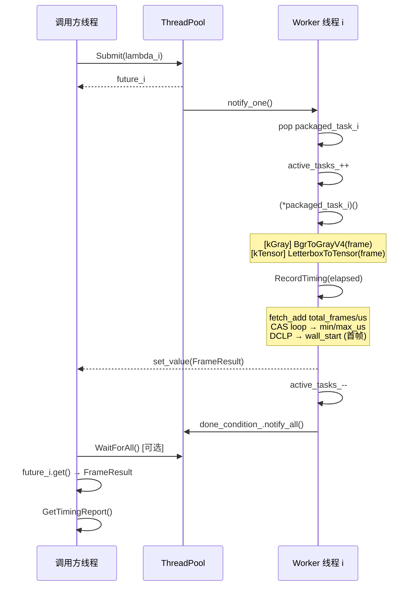
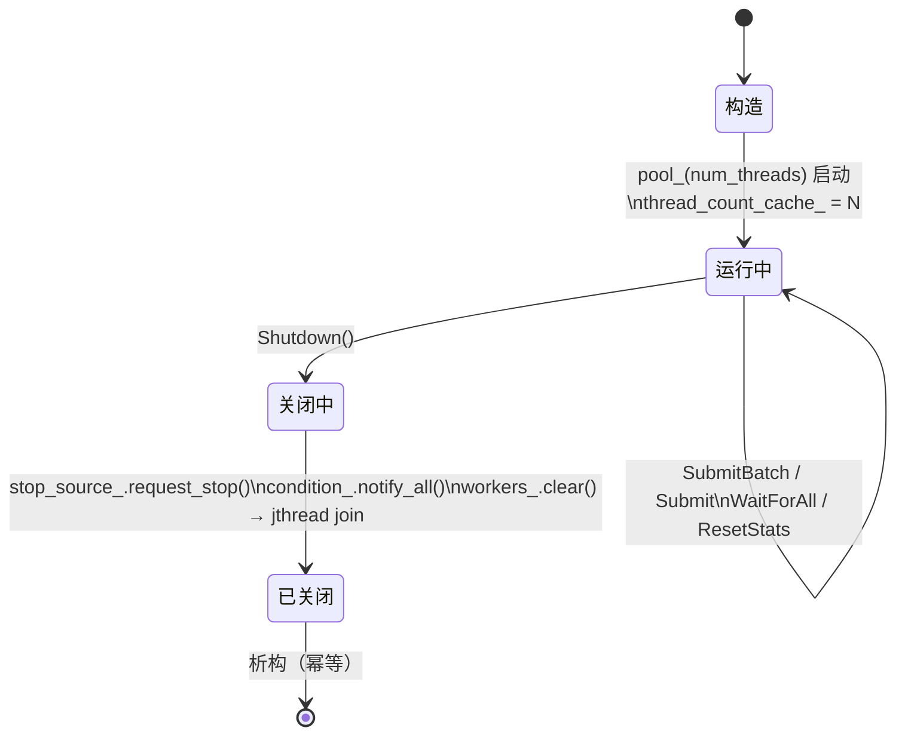
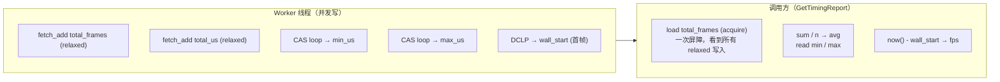

# W13 高性能多线程图像预处理引擎

> **目标**：综合 Q1 所有知识，实现一套基于 C++20 的图像预处理管道，
> 作为 Q2 推理引擎的预处理前端，同时作为简历首个硬核 C++20 并发项目。

---

## 架构总览

```mermaid
flowchart TD
    Caller["调用方\nSubmitBatch(span&lt;const cv::Mat&gt;)"]
    Pool["w5::ThreadPool\njthread + stop_token"]
    Gray["ProcessGray\nw9::BgrToGrayV4"]
    Tensor["ProcessTensor\nw10::LetterboxToTensor"]
    Timing["RecordTiming\n原子统计 mutable"]
    Result["FrameResult\nvariant&lt;Mat, vector&lt;float&gt;&gt;"]
    Report["GetTimingReport\nmin / avg / max / fps"]

    Caller --> Pool
    Pool --> Gray
    Pool --> Tensor
    Gray --> Timing
    Tensor --> Timing
    Timing --> Result
    Result -->|future.get()| Caller
    Timing --> Report
```

---

## 时序图：SubmitBatch 完整调用流程



---

## 生命周期图：ImagePipeline 对象状态



---

## 关键类型

| 类型 | 作用 |
|------|------|
| `ProcessMode` | kGray（灰度）/ kTensor（CHW float32，推理引擎直连） |
| `PipelineConfig` | 模式、目标尺寸、线程数、pad 颜色 |
| `FrameResult` | frame_index + variant<Mat, vector<float>> + LetterboxInfo + 耗时 |
| `TimingReport` | min/avg/max/fps，`ToString()` 输出可重定向至 benchmarks |
| `ImagePipeline` | 主类，持有线程池，对外暴露 SubmitBatch / WaitForAll / GetTimingReport |

---

## 构建与测试

```bash
cmake -B build -S . -DCMAKE_CXX_COMPILER=g++-15 -G Ninja
cmake --build build --target w13_image_pipeline_test w13_pipeline_demo -j$(nproc)

# 运行测试
ctest --test-dir build -R "W13_" --output-on-failure

# 运行演示（可重定向输出至 benchmarks）
./build/01_Linux_CPP_Foundations/w13_image_pipeline/w13_pipeline_demo
./build/01_Linux_CPP_Foundations/w13_image_pipeline/w13_pipeline_demo > docs/benchmarks/Q1_week_13.md
```

---

## 核心设计要点

### 1. 为什么用 `std::variant` 而不是继承

两种模式（kGray/kTensor）的返回类型不同（`cv::Mat` vs `std::vector<float>`）。
用虚函数需要堆分配 + 运行时 vtable 查找；`std::variant` 栈上存储，
`std::holds_alternative` / `std::get` 是零开销的编译期分派。

### 2. `SubmitBatch` 生命周期约定

```cpp
// 仅借用引用，不拷贝像素
const cv::Mat& frame = frames[i];
pool_.Submit([this, &frame, i]() -> FrameResult { ... });
```

`cv::Mat` 是引用计数的浅拷贝，lambda 捕获引用。
**调用方必须保证 `frames` 在所有 `future.get()` 返回前有效**。
实践中把 batch vector 和 futures 放在同一作用域即可。

### 3. 无锁 TimingReport 设计



`memory_order_relaxed` 写入 + 汇总时一次 `memory_order_acquire` 读取，
比全程 `seq_cst` 省去不必要的内存屏障，在多核机器上差异显著。

### 4. `alignas(64)` 消除伪共享

```cpp
// alignas 在前，mutable 在后（C++ 属性语法规则）
alignas(64) mutable std::atomic<uint64_t> total_frames_{0};
alignas(64) mutable std::atomic<uint64_t> total_us_{0};
alignas(64) mutable std::atomic<uint64_t> min_us_{UINT64_MAX};
alignas(64) mutable std::atomic<uint64_t> max_us_{0};
```

四个原子变量并发写入频率相同。若挤在同一缓存行（64 字节），
写 `total_frames_` 的 core 0 修改整条缓存行 → core 1 的 `total_us_` 缓存失效 → 重新加载。
`alignas(64)` 让每个变量独占缓存行，四个 core 可真正并行写入。

### 5. `thread_count_cache_` 的必要性

`w5::ThreadPool::Shutdown()` 内部调用 `workers_.clear()`，
jthread 析构后 `GetThreadCount()` 返回 0。
`ImagePipeline` 在构造后立即缓存线程数，确保 `TimingReport` 中线程数字段始终有效。

---

## Benchmark 结果（1920×1080，合成随机帧，VPS 单核）

> 单核 VPS，硬件并发数 = 1，多线程主要在 I/O 等待场景下有收益。

**场景 A：线程数扩展性（100 帧，kTensor）**

| 线程数 | 墙钟时间 | 加速比 |
|--------|---------|--------|
| 1 | ~916 ms | 1.00× |
| 2 | ~607 ms | 1.51× |
| 4 | ~692 ms | 1.32× |

**场景 B：单帧延迟分布（50 帧，P50/P95/P99）**

| 模式 | P50 | P95 | P99 |
|------|-----|-----|-----|
| kGray | ~510 µs | ~621 µs | ~2354 µs |
| kTensor | ~2554 µs | ~5141 µs | ~5744 µs |

kTensor 约为 kGray 的 5× 慢（Letterbox 内部调用 `cv::resize`，计算量更大）。

---

## Q&A

**Q: 为什么 P99 比 P95 跳跃大？**

单核 VPS 的 OS 调度抖动明显，偶发性的上下文切换会让某帧延迟突增至 2-3×。
生产环境应考虑绑核（`pthread_setaffinity_np`）或实时调度策略（`SCHED_FIFO`）。

**Q: SubmitBatch 的 span 不是"零拷贝"吗？lambda 捕获引用安全吗？**

`std::span` 本身是指针 + 长度的视图，不复制 Mat 像素数据，这是零拷贝。
lambda 捕获 `const cv::Mat&` 是引用，只要调用方把 `batch` vector 的生命周期
覆盖到 `future.get()` 调用完成，就完全安全。
`cv::Mat` 的引用计数保证底层像素不会被意外释放。

**Q: 为什么用 kGray 而不是 `w9::BgrToNormCHW`？**

`BgrToNormCHW` 输出的是 float32 CHW，和 kTensor 的用途完全重叠。
kGray 保留 `cv::Mat CV_8U` 输出，更适合需要灰度图的视觉任务（OCR、人脸检测等），
而 kTensor 专门对接推理引擎 `{1, 3, H, W}` 输入。
两条路径职责分离，不重叠。

**Q: 异常如何传播？**

W9/W10 算子对空帧抛 `std::invalid_argument`。
`w5::ThreadPool::Submit` 内部用 `std::packaged_task` 包装 lambda，
异常被捕获并存入 `shared_state`，调用方 `future.get()` 时重新抛出。
整条路径无需额外 try/catch。
