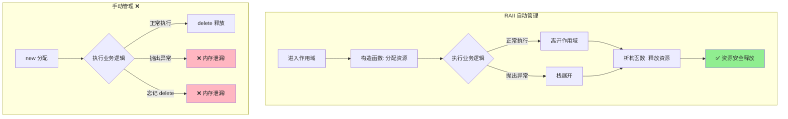
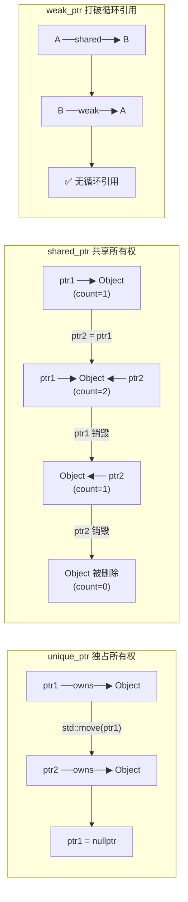

# W1 知识点笔记：RAII 与智能指针

---

## 1. RAII 机制

### 1.1 什么是 RAII？

**RAII** (Resource Acquisition Is Initialization) 是 C++ 最重要的编程范式。

**核心原则**：
- **资源获取即初始化**：在构造函数中获取资源
- **资源释放即销毁**：在析构函数中释放资源
- 无论正常退出还是异常退出，析构函数都会被调用

### 1.2 为什么 AI 推理需要 RAII？

| 场景 | 风险 | RAII 解决方案 |
|------|------|---------------|
| 7x24 小时服务 | 内存泄漏累积导致 OOM | 自动释放保证零泄漏 |
| 频繁分配大内存 | 忘记释放、重复释放 | 析构函数统一管理 |
| 推理异常中断 | 显存无法回收 | 栈展开自动调用析构 |

### 1.3 RAII vs 手动管理

```cpp
// ❌ 手动管理 - 危险
void bad_example() {
    char* buffer = new char[1024];
    risky_operation();  // 如果抛异常，buffer 泄漏！
    delete[] buffer;
}

// ✅ RAII - 安全
void good_example() {
    SafeTensorBuffer buffer(1024);  // 构造时分配
    risky_operation();  // 即使抛异常，buffer 也会被自动析构
}   // 离开作用域，自动释放
```

### 1.4 RAII 生命周期流程图



### 1.5 智能指针所有权转移图



---

## 2. 智能指针

### 2.1 unique_ptr - 独占所有权

**特点**：
- 独占资源所有权，不可复制
- 零开销（与裸指针相同）
- 支持移动语义

**使用场景**：
- 单一所有者
- 工厂函数返回值
- 容器中存储多态对象

```cpp
// 创建
auto ptr = std::make_unique<SafeTensorBuffer>(1024);

// 转移所有权
auto ptr2 = std::move(ptr);  // ptr 变为 nullptr

// 自定义删除器
std::unique_ptr<T, Deleter> ptr(new T, Deleter{});
```

### 2.2 shared_ptr - 共享所有权

**特点**：
- 通过引用计数管理生命周期
- 可以复制，每次复制引用计数 +1
- 最后一个 shared_ptr 销毁时删除对象

**性能注意**：
```
引用计数操作 = 原子操作（线程安全但有开销）
```

**高频场景优化**：
```cpp
// ❌ 值传递 - 每次调用引用计数 +1/-1
void process(std::shared_ptr<T> ptr);

// ✅ 引用传递 - 无引用计数开销
void process(const std::shared_ptr<T>& ptr);

// ✅ 更好 - 如果不需要所有权
void process(const T& obj);
```

### 2.3 weak_ptr - 弱引用

**作用**：解决循环引用问题

**循环引用问题**：
```
A ──shared_ptr──► B
▲                 │
│                 ▼
└──shared_ptr────┘

结果：A 和 B 的引用计数永远不为 0，内存泄漏！
```

**解决方案**：
```cpp
class Node {
    std::shared_ptr<Node> next;  // 强引用
    std::weak_ptr<Node> prev;    // 弱引用（不增加计数）
};
```

**使用 weak_ptr**：
```cpp
std::weak_ptr<T> weak = shared;
if (auto locked = weak.lock()) {
    // locked 是 shared_ptr，对象仍存活
    locked->use();
} else {
    // 对象已被销毁
}
```

---

## 3. 移动语义

### 3.1 右值引用

```cpp
T&   // 左值引用 - 绑定到持久对象
T&&  // 右值引用 - 绑定到临时对象（即将销毁）
```

### 3.2 std::move 的本质

`std::move` 不移动任何东西！它只是类型转换：

```cpp
std::move(x)  ≡  static_cast<T&&>(x)
```

真正的移动发生在移动构造函数中。

### 3.3 移动构造函数

```cpp
class SafeTensorBuffer {
    SafeTensorBuffer(SafeTensorBuffer&& other) noexcept
        : data_(other.data_), size_(other.size_) {
        // 窃取资源
        other.data_ = nullptr;
        other.size_ = 0;
    }
};
```

### 3.4 noexcept 的重要性

| 场景 | 声明 noexcept | 不声明 |
|------|---------------|--------|
| vector 扩容 | 使用移动 ✅ | 使用拷贝 ❌ |
| 性能 | O(1) | O(n) |

---

## 4. 异常安全

### 4.1 异常安全等级

| 等级 | 保证 |
|------|------|
| 无异常安全 | 什么都不保证 |
| 基本保证 | 不泄漏资源，对象处于有效状态 |
| 强保证 | 操作要么成功，要么状态不变 |
| 无异常 | 保证不抛异常（noexcept） |

### 4.2 RAII 提供基本保证

```cpp
void safe_function() {
    SafeTensorBuffer a(1024);  // ✅ a 必定被释放
    SafeTensorBuffer b(2048);  // ✅ b 必定被释放
    
    throw std::runtime_error("error");
    // 栈展开：b.~SafeTensorBuffer() → a.~SafeTensorBuffer()
}
```

---

## 5. 性能对比

### shared_ptr 引用计数开销

| 操作 | 开销 |
|------|------|
| 创建 shared_ptr | 分配控制块 + 原子操作 |
| 拷贝 shared_ptr | 原子递增 |
| 销毁 shared_ptr | 原子递减 + 条件删除 |

**高频推理场景**（每帧 30 次）：
- 使用 unique_ptr 或 const 引用传递
- 避免在热路径上拷贝 shared_ptr

---

## 6. 最佳实践总结

| 场景 | 推荐方案 |
|------|----------|
| 单一所有者 | `unique_ptr` |
| 共享所有权 | `shared_ptr` |
| 可能悬空的观察者 | `weak_ptr` |
| 传递使用但不持有 | `const T&` 或 `const shared_ptr<T>&` |
| 转移所有权 | `std::move` + 移动构造 |

## 7. 其他技巧
```git
#撤销最近的一次提交并保存之前的修改记录
git revert --no-edit HEAD
```
