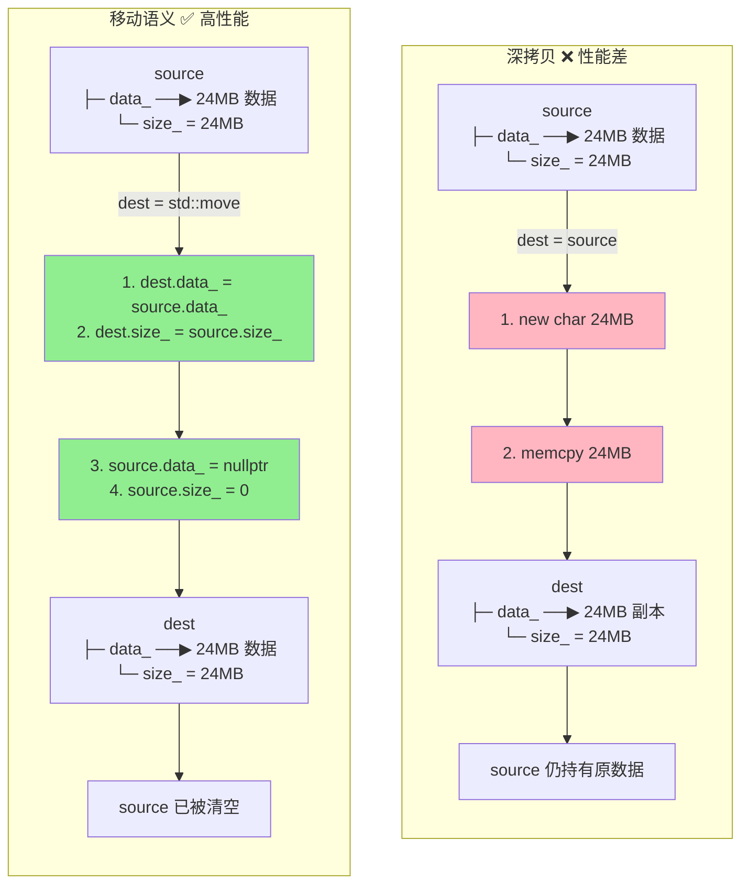

# W2：移动语义与零拷贝知识笔记

> **核心观点**：在边缘端处理 4K/8K 图像时，深拷贝是巨大的性能浪费。移动语义通过转移所有权而非复制数据，实现真正的零拷贝。

---

## 1. 右值引用 (T&&) 本质理解

### 1.1 左值与右值

```cpp
int x = 10;        // x 是左值（有名称，可取地址）
int y = x + 5;     // x + 5 是右值（临时值，无法取地址）
CustomImage img;   // img 是左值
CustomImage();     // CustomImage() 是右值（临时对象）
```

**核心区别**：
- **左值 (lvalue)**：有持久身份，程序中可多次访问
- **右值 (rvalue)**：临时的，即将销毁，资源可被"窃取"

### 1.2 右值引用的意义

```cpp
void Process(CustomImage&& img);  // 接收右值引用
```

右值引用 `T&&` 的作用：
1. 绑定到即将销毁的临时对象
2. 允许"偷走"其内部资源
3. 避免不必要的深拷贝

---

## 2. std::move 实现原理

### 2.1 std::move 并不移动任何东西！

```cpp
// std::move 的简化实现
template <typename T>
typename std::remove_reference<T>::type&& move(T&& arg) noexcept {
  return static_cast<typename std::remove_reference<T>::type&&>(arg);
}
```

**关键理解**：
- `std::move` 只是一个**类型转换**
- 它将左值转换为右值引用
- 真正的移动发生在**移动构造函数/移动赋值运算符**中

### 2.2 使用示例

```cpp
CustomImage source(128);
CustomImage dest = std::move(source);  // 调用移动构造函数
// 此时 source.data_ 已经是 nullptr
```

### 2.3 深拷贝 vs 移动语义流程对比



**关键对比**:

| 操作 | 深拷贝 | 移动语义 |
|------|--------|----------|
| 内存分配 | new 24MB | 无 |
| 数据传输 | memcpy 24MB | 3 个指针赋值 |
| 时间复杂度 | O(n) | O(1) |
| 1000 帧 4K 图像 | 数秒 | 毫秒级 |

---

## 3. 移动构造函数编写规范

### 3.1 Rule of Five

如果定义了以下任一函数，通常需要定义全部五个：

| 特殊成员函数 | 作用 |
|-------------|------|
| 析构函数 | 释放资源 |
| 拷贝构造函数 | 深拷贝资源 |
| 拷贝赋值运算符 | 深拷贝赋值 |
| 移动构造函数 | 转移资源所有权 |
| 移动赋值运算符 | 转移赋值 |

### 3.2 移动构造函数模板

```cpp
class CustomImage {
public:
  // 移动构造函数
  CustomImage(CustomImage&& other) noexcept
      : data_(other.data_), size_(other.size_) {
    other.data_ = nullptr;  // 关键：置空源对象
    other.size_ = 0;
  }

  // 移动赋值运算符
  CustomImage& operator=(CustomImage&& other) noexcept {
    if (this != &other) {
      delete[] data_;        // 释放当前资源
      data_ = other.data_;   // 转移所有权
      size_ = other.size_;
      other.data_ = nullptr; // 置空源对象
      other.size_ = 0;
    }
    return *this;
  }
};
```

### 3.3 noexcept 的重要性

```cpp
// 必须标记 noexcept！
CustomImage(CustomImage&& other) noexcept;
```

**原因**：`std::vector` 在扩容时，只有当移动构造函数是 `noexcept` 时才会使用移动语义，否则回退到拷贝以保证强异常安全。

---

## 4. 完美转发 std::forward

### 4.1 问题背景

```cpp
template <typename T>
void Wrapper(T&& arg) {
  // arg 在函数内部是左值！（因为它有名字）
  Process(arg);  // 总是调用左值版本，错误！
}
```

### 4.2 std::forward 解决方案

```cpp
template <typename T>
void Wrapper(T&& arg) {
  Process(std::forward<T>(arg));  // 保持原始值类别
}
```

**完美转发原理**：
- 如果传入左值，`T` 推导为 `Type&`，forward 返回左值引用
- 如果传入右值，`T` 推导为 `Type`，forward 返回右值引用

### 4.3 实际应用：emplace_back

```cpp
template <typename... Args>
void vector<T>::emplace_back(Args&&... args) {
  // 使用完美转发，在 vector 内存中原地构造
  new (end_ptr) T(std::forward<Args>(args)...);
}
```

---

## 5. 编译期类型验证

### 5.1 使用 static_assert

```cpp
#include <type_traits>

// 验证类型可移动
static_assert(std::is_move_constructible_v<CustomImage>,
              "CustomImage must be move constructible");

// 验证移动操作不抛异常
static_assert(std::is_nothrow_move_constructible_v<CustomImage>,
              "Move constructor must be noexcept");
```

### 5.2 常用类型特性

| 特性 | 含义 |
|-----|------|
| `is_move_constructible` | 可移动构造 |
| `is_move_assignable` | 可移动赋值 |
| `is_nothrow_move_constructible` | 移动构造不抛异常 |
| `is_trivially_move_constructible` | 平凡移动（memcpy） |

---

## 6. 性能对比总结

| 操作 | 4K 图像 (~24MB) | 1000 帧总耗时 |
|------|-----------------|---------------|
| 深拷贝 | 复制 24MB 数据 | 数秒级 |
| 移动语义 | 仅 3 个指针赋值 | 毫秒级 |
| emplace_back | 原地构造 | 毫秒级 |

---

## 7. 最佳实践

1. **优先使用 `emplace_back`** 而非 `push_back`
2. **移动构造函数必须标记 `noexcept`**
3. **移动后的对象应处于有效但未定义状态**
4. **使用 `static_assert` 在编译期验证类型特性**
5. **避免对已移动对象进行操作**（除了析构和赋值）

---

## 参考资源

- [cppreference: std::move](https://en.cppreference.com/w/cpp/utility/move)
- [cppreference: std::forward](https://en.cppreference.com/w/cpp/utility/forward)
- Effective Modern C++ - Item 23-30
