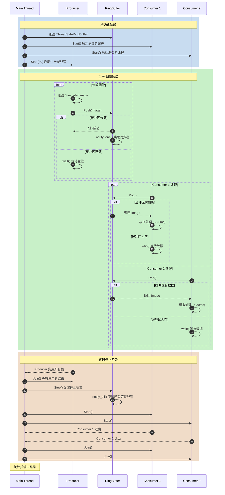

# W4：并发编程基础 - 多线程与任务同步

## 核心知识点

### 1. std::thread 生命周期管理

```cpp
std::thread t(func, args...);  // 创建线程
t.join();                       // 等待线程结束（阻塞）
t.detach();                     // 分离线程（后台运行）
```

**关键原则**：
- 线程对象销毁前必须调用 `join()` 或 `detach()`
- 未处理的线程对象销毁会调用 `std::terminate()`
- 优先使用 `join()` 确保资源正确释放

### 2. std::mutex 与锁守卫

```cpp
std::mutex mtx;

// 方式1：lock_guard（简单场景）
{
  std::lock_guard<std::mutex> lock(mtx);
  // 临界区操作
}  // 自动解锁

// 方式2：unique_lock（需要手动控制）
{
  std::unique_lock<std::mutex> lock(mtx);
  // 可以手动 lock.unlock() / lock.lock()
  // 可以与 condition_variable 配合使用
}
```

**选择指南**：
| 场景 | 推荐 |
|------|------|
| 简单互斥 | `lock_guard` |
| 需要手动解锁 | `unique_lock` |
| 配合条件变量 | `unique_lock` |
| 延迟加锁 | `unique_lock` |

### 3. std::condition_variable

条件变量用于线程间的同步通知机制。

```cpp
std::condition_variable cv;
std::mutex mtx;
bool ready = false;

// 等待线程
{
  std::unique_lock<std::mutex> lock(mtx);
  cv.wait(lock, []{ return ready; });  // 等待条件满足
  // 条件满足后继续执行
}

// 通知线程
{
  std::lock_guard<std::mutex> lock(mtx);
  ready = true;
}
cv.notify_one();  // 唤醒一个等待线程
// cv.notify_all();  // 唤醒所有等待线程
```

**wait() 的工作原理**：
1. 检查谓词（predicate），如果为 true 则继续
2. 如果为 false，释放锁并进入等待状态
3. 被唤醒后重新获取锁
4. 再次检查谓词，防止虚假唤醒（spurious wakeup）

### 4. 数据竞争（Data Race）

当两个或更多线程同时访问同一内存位置，且至少一个是写操作时，就会发生数据竞争。

**检测工具**：
```bash
# 使用 ThreadSanitizer 编译
cmake -DENABLE_TSAN=ON ..
make
./producer_consumer
```

### 5. 死锁（Deadlock）

死锁的四个必要条件：
1. **互斥**：资源只能被一个线程持有
2. **持有并等待**：持有资源的线程等待其他资源
3. **不可抢占**：资源不能被强制释放
4. **循环等待**：线程形成循环等待链

**预防策略**：
- 按固定顺序获取锁
- 使用 `std::scoped_lock` 同时获取多个锁
- 设置超时机制

---

## 生产者-消费者模型

### 设计模式

```
┌──────────────┐    ┌─────────────────────┐    ┌──────────────┐
│  Producer    │───►│  Ring Buffer        │───►│  Consumer    │
│  (摄像头)    │    │  (线程安全队列)      │    │  (预处理)    │
└──────────────┘    └─────────────────────┘    └──────────────┘
```

### 环形缓冲区（Ring Buffer）

优点：
- 固定大小，无需动态分配
- 高效的入队/出队操作 O(1)
- 缓存友好

```
       head                   tail
         ▼                      ▼
     ┌───┬───┬───┬───┬───┬───┬───┬───┐
     │   │ A │ B │ C │ D │   │   │   │
     └───┴───┴───┴───┴───┴───┴───┴───┘
         ◄─────── count ───────►
```

### 项目时序图

下图展示了我们项目中生产者-消费者模型的完整执行流程：



**时序图说明**：

| 阶段 | 关键操作 | 涉及的同步机制 |
|------|----------|----------------|
| 初始化 | 创建缓冲区、启动线程 | `std::thread` 构造 |
| 生产-消费 | Push/Pop 操作 | `mutex` + `condition_variable` |
| 优雅停止 | Stop() + Join() | `atomic<bool>` + `notify_all()` |

---

## AI 部署场景应用

### 1. 视频流处理流水线

```
摄像头采集 ──► 解码 ──► 预处理 ──► 推理 ──► 后处理 ──► 显示
    │           │          │         │          │
    └───────────┴──────────┴─────────┴──────────┘
              通过环形缓冲区连接各阶段
```

### 2. 多路视频并发

```cpp
// 每路视频流一个生产者-消费者对
std::vector<BufferType> buffers(kNumCameras);
std::vector<ImageProducer> producers;
std::vector<ImageConsumer> consumers;

for (int i = 0; i < kNumCameras; ++i) {
  producers.emplace_back(buffers[i], fps);
  consumers.emplace_back(buffers[i], i);
}
```

### 3. 性能指标

| 指标 | 计算方式 | 目标值 |
|------|----------|--------|
| 吞吐量 | frames / second | ≥ 30 FPS |
| 延迟 | capture_time - process_time | < 100ms |
| 丢帧率 | dropped / total | < 1% |

---

## 常见问题与解决方案

### Q1: 消费者处理速度跟不上生产者怎么办？

**解决方案**：
1. 增加消费者数量
2. 增大缓冲区容量
3. 生产者端实现丢帧策略
4. 优化消费者处理性能

### Q2: 如何优雅地停止所有线程？

```cpp
// 1. 设置停止标志
buffer.Stop();

// 2. 停止消费者循环
for (auto& consumer : consumers) {
  consumer.Stop();
}

// 3. 等待所有线程结束
for (auto& consumer : consumers) {
  consumer.Join();
}
```

### Q3: 如何避免虚假唤醒？

始终在 `wait()` 中使用谓词：

```cpp
// ✗ 错误：可能虚假唤醒后立即执行
cv.wait(lock);

// ✓ 正确：谓词会再次检查条件
cv.wait(lock, [this]{ return count_ > 0 || stopped_; });
```

---

## 编译与测试

```bash
# 标准构建
mkdir build && cd build
cmake ..
make -j$(nproc)
./producer_consumer

# 使用 ThreadSanitizer 检测数据竞争
cmake -DENABLE_TSAN=ON ..
make -j$(nproc)
./producer_consumer
```

---

## 参考资料

- C++ Concurrency in Action (2nd Edition) - Anthony Williams
- [cppreference: std::condition_variable](https://en.cppreference.com/w/cpp/thread/condition_variable)
- [Google Thread Sanitizer](https://clang.llvm.org/docs/ThreadSanitizer.html)
