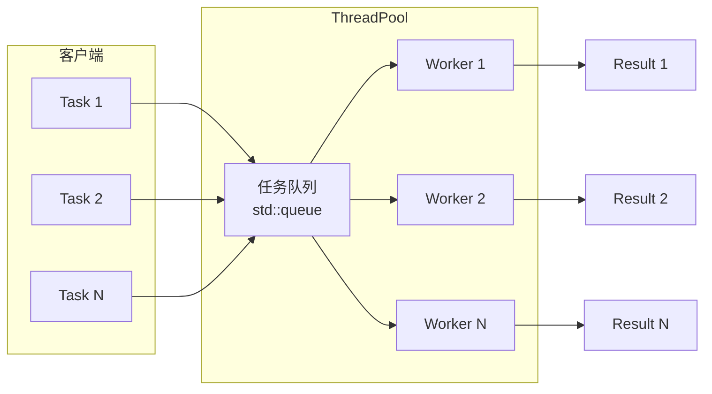
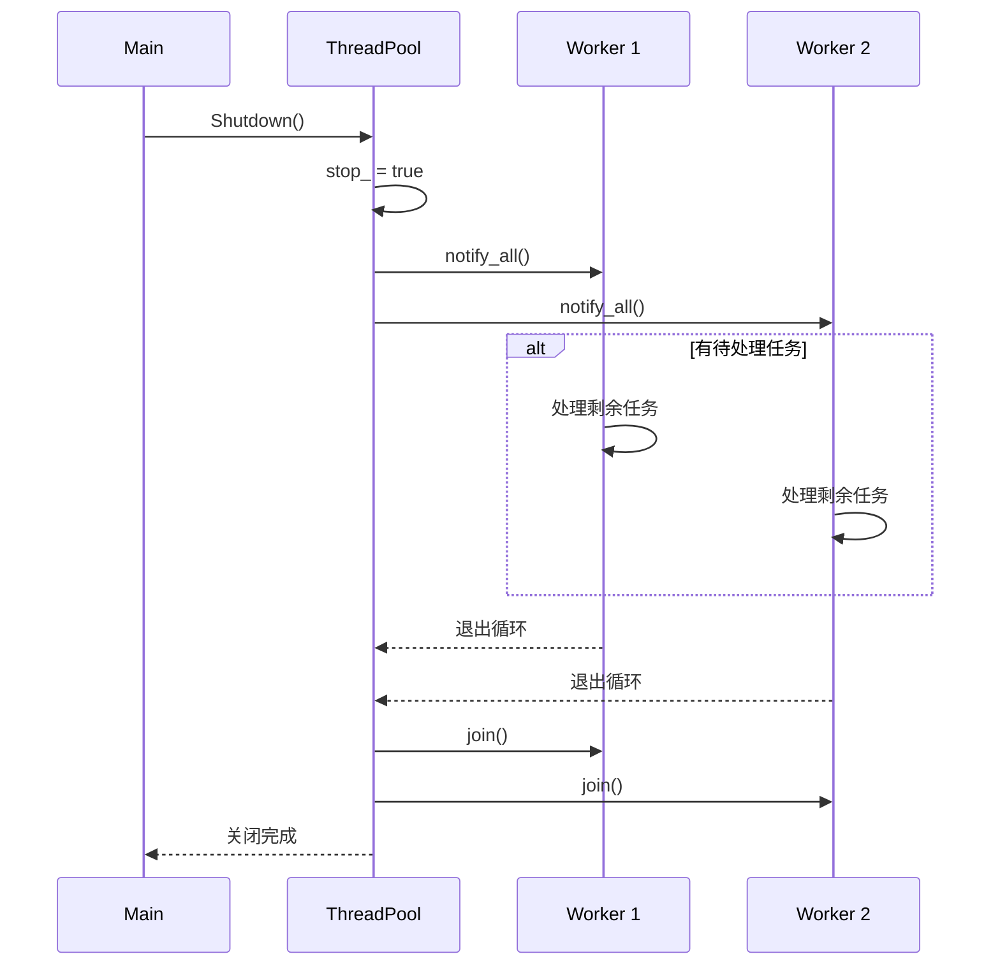
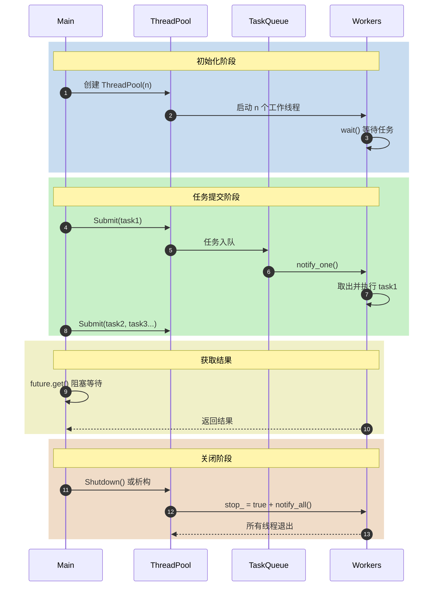

# W5：高性能并发进阶 - 通用线程池架构

> **核心价值**：频繁创建/销毁线程开销巨大，线程池是多路视频流 AI 推理的工业标配。

---

## 核心知识点

### 1. 为什么需要线程池？

| 方式 | 开销 | 适用场景 |
|------|------|----------|
| 每任务创建线程 | 高（线程创建/销毁） | 少量长任务 |
| **线程池** | 低（复用工作线程） | 大量短任务 |

**AI 推理场景**：
- 每秒 30 帧视频需要处理
- 每帧可能需要多个预处理步骤
- 线程池避免反复创建销毁线程

---

### 2. 核心组件



---

### 3. std::packaged_task 与 std::future

**问题**：如何获取异步任务的返回值？

**解决方案**：

```cpp
// 1. 将任务包装成 packaged_task
auto task = std::make_shared<std::packaged_task<int()>>(
    []() { return 42; }
);

// 2. 获取关联的 future
std::future<int> result = task->get_future();

// 3. 执行任务（可在另一线程）
(*task)();

// 4. 获取结果（阻塞直到任务完成）
int value = result.get();  // value = 42
```

**关键点**：
- `packaged_task` 将可调用对象包装，并关联一个 `future`
- `future.get()` 阻塞等待结果
- 异常会通过 `future` 传播

---

### 4. 泛型任务提交

```cpp
template <typename F, typename... Args>
auto Submit(F&& func, Args&&... args)
    -> std::future<std::invoke_result_t<F, Args...>> {
  
  using ReturnType = std::invoke_result_t<F, Args...>;
  
  // 绑定函数和参数
  auto task = std::make_shared<std::packaged_task<ReturnType()>>(
      std::bind(std::forward<F>(func), std::forward<Args>(args)...)
  );
  
  auto result = task->get_future();
  
  // 入队（转换为 void() 类型）
  tasks_.emplace([task]() { (*task)(); });
  
  return result;
}
```

**模板技术要点**：
- `std::invoke_result_t`：推导返回类型
- `std::forward`：完美转发参数
- `std::bind`：将函数和参数绑定成无参可调用对象

---

### 5. 优雅关闭策略



**关键步骤**：
1. 设置停止标志 `stop_ = true`
2. 唤醒所有等待线程 `notify_all()`
3. 等待所有线程结束 `join()`

---

## 项目时序图



---

## 性能测试结果

| 测试项 | 结果 |
|--------|------|
| 基础功能 | ✅ PASSED |
| 100 任务并行 | ✅ PASSED (加速比 > 1.0x) |
| 空闲 CPU | ✅ ~0% |
| 优雅关闭 | ✅ 20/20 任务完成 |
| WaitForAll | ✅ 50/50 任务完成 |
| 异常传播 | ✅ 正确捕获 |

---

## 编译与测试

```bash
# 标准构建
mkdir build && cd build
cmake ..
make -j$(nproc)
./thread_pool_test

# 使用 ThreadSanitizer
cmake -DENABLE_TSAN=ON ..
make -j$(nproc)
./thread_pool_test
```

---

## 最佳实践

1. **线程数选择**：通常使用 `std::thread::hardware_concurrency()`
2. **避免任务内阻塞**：长时间阻塞会降低线程池效率
3. **合理拆分任务**：任务粒度太细会增加调度开销
4. **使用 WaitForAll**：需要同步点时使用
5. **异常处理**：通过 `future.get()` 捕获任务异常

---

## 参考资料

- [cppreference: std::packaged_task](https://en.cppreference.com/w/cpp/thread/packaged_task)
- [cppreference: std::future](https://en.cppreference.com/w/cpp/thread/future)
- C++ Concurrency in Action - Chapter 9: Thread pools
