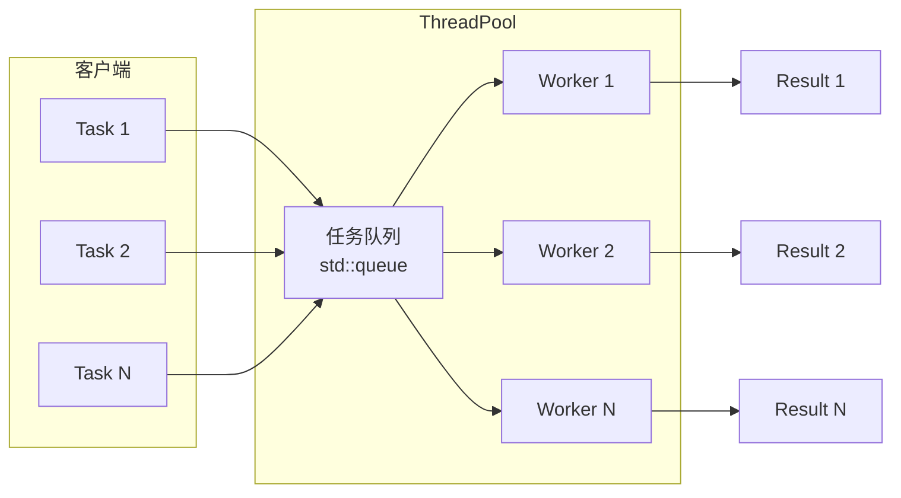
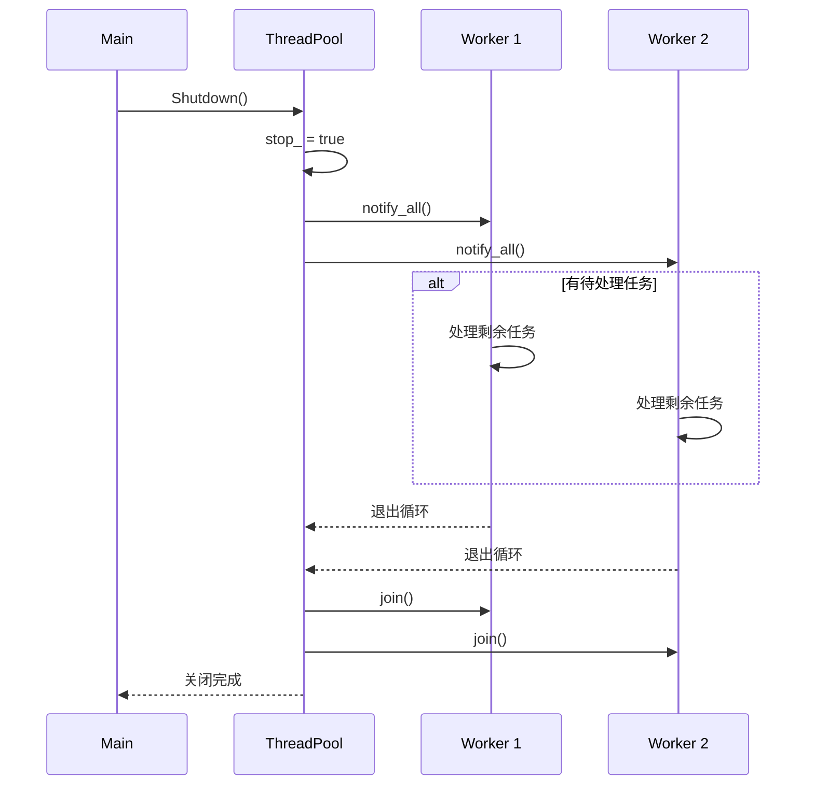
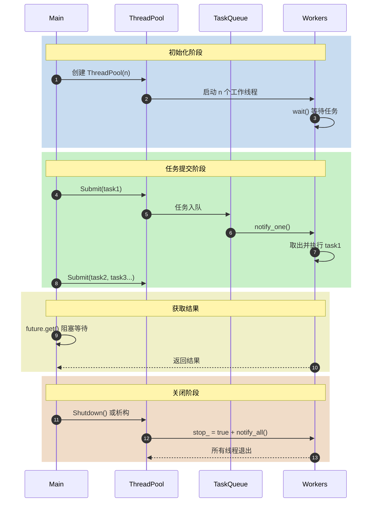
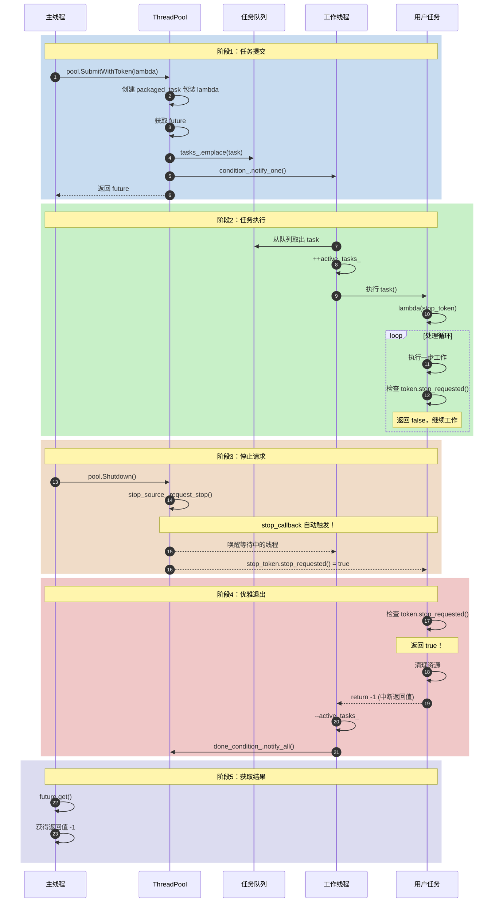

# W5：高性能并发进阶 - 通用线程池架构

> **核心价值**：频繁创建/销毁线程开销巨大，线程池是多路视频流 AI 推理的工业标配。

---

## 核心知识点

### 1. 为什么需要线程池？

| 方式 | 开销 | 适用场景 |
|------|------|----------|
| 每任务创建线程 | 高（线程创建/销毁） | 少量长任务 |
| **线程池** | 低（复用工作线程） | 大量短任务 |

**AI 推理场景**：
- 每秒 30 帧视频需要处理
- 每帧可能需要多个预处理步骤
- 线程池避免反复创建销毁线程

---

### 2. 核心组件



---

### 3. std::packaged_task 与 std::future

**问题**：如何获取异步任务的返回值？

**解决方案**：

```cpp
// 1. 将任务包装成 packaged_task
auto task = std::make_shared<std::packaged_task<int()>>(
    []() { return 42; }
);

// 2. 获取关联的 future
std::future<int> result = task->get_future();

// 3. 执行任务（可在另一线程）
(*task)();

// 4. 获取结果（阻塞直到任务完成）
int value = result.get();  // value = 42
```

**关键点**：
- `packaged_task` 将可调用对象包装，并关联一个 `future`
- `future.get()` 阻塞等待结果
- 异常会通过 `future` 传播

---

### 4. 泛型任务提交

```cpp
template <typename F, typename... Args>
auto Submit(F&& func, Args&&... args)
    -> std::future<std::invoke_result_t<F, Args...>> {
  
  using ReturnType = std::invoke_result_t<F, Args...>;
  
  // 绑定函数和参数
  auto task = std::make_shared<std::packaged_task<ReturnType()>>(
      std::bind(std::forward<F>(func), std::forward<Args>(args)...)
  );
  
  auto result = task->get_future();
  
  // 入队（转换为 void() 类型）
  tasks_.emplace([task]() { (*task)(); });
  
  return result;
}
```

**模板技术要点**：
- `std::invoke_result_t`：推导返回类型
- `std::forward`：完美转发参数
- `std::bind`：将函数和参数绑定成无参可调用对象

---

### 5. 优雅关闭策略



**关键步骤**：
1. 设置停止标志 `stop_ = true`
2. 唤醒所有等待线程 `notify_all()`
3. 等待所有线程结束 `join()`

---

## 项目时序图



---

## C++20/23 增强特性

### 6. std::jthread 与 std::stop_token

**传统方式 vs C++20**：

| 特性 | std::thread | std::jthread |
|------|-------------|--------------|
| 析构时行为 | 必须 join/detach | 自动 request_stop + join |
| 停止机制 | 手动 `std::atomic<bool>` | 内置 `std::stop_token` |
| 异步唤醒 | 需要 notify | `stop_callback` 自动唤醒 |

```cpp
// C++20: std::jthread + stop_token
workers_.emplace_back([this](std::stop_token stop_token) {
  while (!stop_token.stop_requested()) {
    // condition_variable_any 配合 stop_token
    condition_.wait(lock, stop_token, [this]() {
      return !tasks_.empty();
    });
    // 收到 stop_request 时自动唤醒
  }
});
```

---

### 7. Concepts 约束模板

```cpp
// C++17: 无约束，编译错误难以理解
template <typename F, typename... Args>
auto Submit(F&& func, Args&&... args);

// C++20: 使用 Concepts 约束
template <typename F, typename... Args>
  requires std::invocable<F, Args...>  // 编译时检查
auto Submit(F&& func, Args&&... args);
```

**优势**：
- 编译期类型安全检查
- 错误信息更友好
- 代码意图更清晰

---

### 8. 缓存行对齐与伪共享

**问题**：多核 CPU 上，不同核心频繁读写相邻内存地址会导致缓存行失效（伪共享）。

**解决方案**：

```cpp
// 热点变量独占缓存行（64 字节）
alignas(64) std::stop_source stop_source_;
char padding_stop_[64 - sizeof(std::stop_source)];

alignas(64) std::atomic<size_t> active_tasks_;
char padding_active_[64 - sizeof(std::atomic<size_t>)];
```

**布局策略**：
- **冷数据**：初始化后很少修改 (`workers_`)
- **温数据**：互斥锁保护 (`tasks_`, `queue_mutex_`)
- **热数据**：高频访问，需隔离 (`stop_source_`, `active_tasks_`)

---

### 9. SubmitWithToken - 可中断任务

```cpp
// 提交可响应停止请求的任务
auto future = pool.SubmitWithToken([](std::stop_token token) {
  while (!token.stop_requested()) {
    // 长时间运行的工作...
    if (token.stop_requested()) {
      return -1;  // 优雅退出
    }
  }
  return 0;
});

pool.Shutdown();  // 触发 stop_request
int result = future.get();  // 获取中断返回值
```

---

## 性能测试结果

| 测试项 | 结果 |
|--------|------|
| 基础功能 | ✅ PASSED |
| 100 任务并行 | ✅ PASSED |
| 空闲 CPU | ✅ ~0% |
| 优雅关闭 | ✅ 20/20 任务完成 |
| WaitForAll | ✅ 50/50 任务完成 |
| 异常传播 | ✅ 正确捕获 |
| **Stop Token 中断** | ✅ PASSED (C++20) |

---

## 编译与测试

```bash
# C++20 标准构建 (需要 GCC 13+)
mkdir build && cd build
cmake ..
make -j$(nproc)
./thread_pool_test

# 使用 ThreadSanitizer
cmake -DENABLE_TSAN=ON ..
make -j$(nproc)
./thread_pool_test
```

> **注意**：CMakeLists.txt 已设置 `CMAKE_CXX_STANDARD 20`

---

## 最佳实践

1. **线程数选择**：通常使用 `std::thread::hardware_concurrency()`
2. **避免任务内阻塞**：长时间阻塞会降低线程池效率
3. **合理拆分任务**：任务粒度太细会增加调度开销
4. **使用 WaitForAll**：需要同步点时使用
5. **异常处理**：通过 `future.get()` 捕获任务异常
6. **长任务用 SubmitWithToken**：支持优雅中断
7. **热点变量对齐**：`alignas(64)` 消除伪共享

---

## 参考资料

- [cppreference: std::jthread](https://en.cppreference.com/w/cpp/thread/jthread)
- [cppreference: std::stop_token](https://en.cppreference.com/w/cpp/thread/stop_token)
- [cppreference: std::packaged_task](https://en.cppreference.com/w/cpp/thread/packaged_task)
- [cppreference: std::future](https://en.cppreference.com/w/cpp/thread/future)
- C++ Concurrency in Action - Chapter 9: Thread pools

---

## C++14 vs C++20 对比复盘

本节帮助从 C++11/14 过渡到 C++20 的开发者理解关键变化。

### 10. 线程管理对比

| 特性 | C++11/14 | C++20 | 改进点 |
|------|----------|-------|--------|
| **线程类型** | `std::thread` | `std::jthread` | RAII 自动汇合 |
| **停止机制** | 手动 `std::atomic<bool> stop_` | `std::stop_token` | 标准化、类型安全 |
| **析构行为** | 必须 join/detach，否则 terminate | 自动 request_stop + join | 防止资源泄漏 |
| **协同中断** | 需要自定义 | 内置 stop_callback | 零样板代码 |

**C++14 代码 (旧)**:
```cpp
class ThreadPool {
  std::vector<std::thread> workers_;
  std::atomic<bool> stop_{false};  // 手动管理

  ~ThreadPool() {
    stop_ = true;            // 设置停止标志
    condition_.notify_all(); // 唤醒所有线程
    for (auto& t : workers_) {
      if (t.joinable()) t.join();  // 必须手动 join
    }
  }

  void WorkerLoop() {
    while (!stop_) {  // 检查手动标志
      condition_.wait(lock, [this]() {
        return stop_ || !tasks_.empty();  // 必须同时检查 stop_
      });
      // ...
    }
  }
};
```

**C++20 代码 (新)**:
```cpp
class ThreadPool {
  std::vector<std::jthread> workers_;
  std::stop_source stop_source_;  // 标准化机制

  ~ThreadPool() {
    stop_source_.request_stop();  // 通知停止
    condition_.notify_all();
    workers_.clear();  // jthread 析构时自动 join！
  }

  void WorkerLoop(std::stop_token stop_token) {  // 自动传入
    while (!stop_token.stop_requested()) {
      // condition_variable_any 直接支持 stop_token！
      condition_.wait(lock, stop_token, [this]() {
        return !tasks_.empty();  // 只检查任务队列
      });
      // ...
    }
  }
};
```

---

### 11. stop_token 如何优雅替代手动标志位

**问题**：C++14 中使用 `std::atomic<bool> stop_` 存在以下痛点：

| 痛点 | 描述 | C++20 解决方案 |
|------|------|----------------|
| 忘记检查 | 开发者可能遗漏 `stop_` 检查 | stop_token 集成到 wait() |
| 唤醒延迟 | 需要手动 notify_all | stop_callback 自动唤醒 |
| 接口不统一 | 每个线程池实现不同 | 标准化 stop_token 协议 |
| 组合困难 | 难以传递给子任务 | stop_token 可任意传递 |

**stop_callback 工作原理**:

```cpp
// 当调用 condition_.wait(lock, stop_token, predicate) 时，内部会：

std::stop_callback callback(stop_token, [&condition_]() {
  condition_.notify_all();  // 自动注册唤醒回调
});

// 当 stop_source_.request_stop() 被调用时：
// 1. stop_token.stop_requested() 变为 true
// 2. 所有注册的 stop_callback 被自动调用
// 3. 阻塞在 wait() 上的线程被唤醒
// 4. wait() 返回 false（因为 predicate 可能仍为 false）
```

---

### 12. Concepts 如何改善编译器报错

**C++14 使用 SFINAE 约束模板 (晦涩难懂)**:

```cpp
// 约束 F 必须可调用
template <typename F, typename... Args,
          typename = std::enable_if_t<
              std::is_invocable_v<F, Args...>>>
auto Submit(F&& func, Args&&... args);
```

**传入不可调用类型时的 C++14 错误信息**:
```
error: no matching function for call to 'Submit'
note: candidate template ignored: requirement 
  'is_invocable_v<int, double>' was not satisfied
note: in instantiation of template type alias 'enable_if_t'
note: while substituting... [展开 20 行模板错误]
```

**C++20 使用 Concepts 约束模板 (清晰直观)**:

```cpp
template <typename F, typename... Args>
  requires std::invocable<F, Args...>
auto Submit(F&& func, Args&&... args);
```

**传入不可调用类型时的 C++20 错误信息**:
```
error: constraints not satisfied for 'Submit<int, double>'
note: the required expression 'std::invoke(f, args...)' is invalid
note: because 'int' is not invocable with 'double'
```

**对比总结**:

| 维度 | C++14 SFINAE | C++20 Concepts |
|------|--------------|----------------|
| 可读性 | 低（enable_if 嵌套） | 高（requires 直观） |
| 错误信息 | 大量模板展开 | 直接指出约束失败 |
| 代码意图 | 隐藏在类型推导中 | 显式声明约束 |
| 组合能力 | 困难 | 可定义自定义 Concept |

---

## SubmitWithToken 任务生命周期

以下流程图展示一个可中断任务从提交到响应停止请求的完整生命周期：



---

### 流程图关键点解读

| 阶段 | 关键事件 | 涉及组件 |
|------|----------|----------|
| **提交** | `SubmitWithToken` 将 lambda 包装成 `packaged_task` | Main → Pool → Queue |
| **执行** | Worker 取出任务，`stop_token` 被传入 lambda | Queue → Worker → Task |
| **中断** | `request_stop()` 触发所有 `stop_callback` | Pool → stop_token |
| **退出** | 任务检测到 `stop_requested()`，返回中断值 | Task → Worker |
| **结果** | `future.get()` 获取返回值（或异常） | Main |
