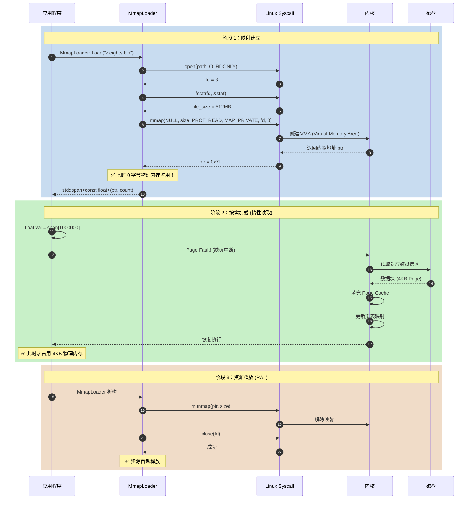
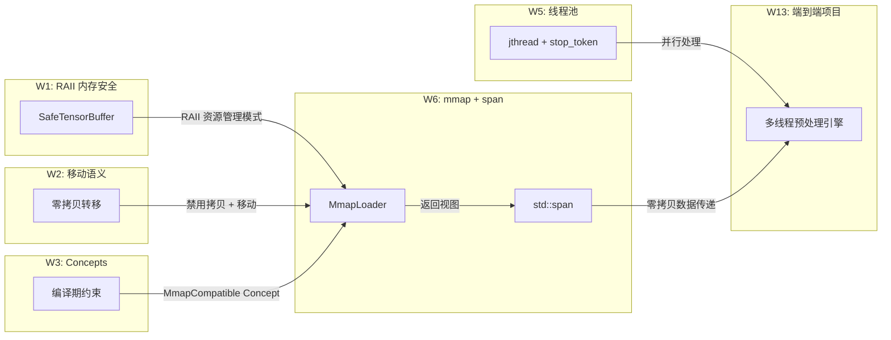

# W6：Linux 高性能 I/O - 文件映射 mmap 与 std::span

> **核心价值**：加载数 GB 模型权重时，`mmap` 是零拷贝加载、提升启动速度的关键。

---

## 技术架构概览

### 1. 问题背景：传统 I/O 的性能瓶颈

在边缘 AI 部署场景中，模型权重文件（如 `.onnx`、`.engine`）通常达到数百 MB 甚至数 GB。传统文件读取方式存在严重的性能问题：

| 问题维度 | 传统 I/O (fstream/read) | 本周方案 (mmap + std::span) |
|----------|------------------------|----------------------------|
| 内存拷贝次数 | 2 次 (内核缓冲区 → 用户缓冲区 → 目标对象) | 0 次 (直接映射到进程地址空间) |
| 内存占用 | 2 倍文件大小 | 按需加载 (Page Fault) |
| 启动延迟 | 高 (必须读取完整文件) | 低 (惰性加载) |
| 边界安全 | 手动管理指针和长度 | `std::span` 自动携带边界信息 |
| 类型安全 | `void*` 类型不安全 | 模板化 `std::span<T>` 类型安全 |

### 2. 核心技术栈

```
┌─────────────────────────────────────────────────────────────────┐
│                      应用层 (Application)                        │
│  ┌──────────────────────────────────────────────────────────┐   │
│  │  MmapLoader<T>  +  MemoryMappedView<T>                   │   │
│  │  - C++20 Concepts 约束                                   │   │
│  │  - RAII 资源管理                                         │   │
│  │  - std::span<T> / std::span<const T> 视图接口            │   │
│  └──────────────────────────────────────────────────────────┘   │
├─────────────────────────────────────────────────────────────────┤
│                      抽象层 (Abstraction)                        │
│  ┌──────────────────────────────────────────────────────────┐   │
│  │  std::span<T>  - C++20 边界安全视图                       │   │
│  │  - 封装 (T*, size_t) 为统一接口                          │   │
│  │  - subspan() / first() / last() 切片操作                 │   │
│  │  - 编译时/运行时长度推断                                  │   │
│  └──────────────────────────────────────────────────────────┘   │
├─────────────────────────────────────────────────────────────────┤
│                      系统调用层 (Syscall)                        │
│  ┌──────────────────────────────────────────────────────────┐   │
│  │  mmap() / munmap() / madvise()                           │   │
│  │  open() / close() / fstat()                              │   │
│  └──────────────────────────────────────────────────────────┘   │
├─────────────────────────────────────────────────────────────────┤
│                      内核层 (Kernel)                             │
│  ┌──────────────────────────────────────────────────────────┐   │
│  │  Page Cache  ←→  MMU (内存管理单元)                       │   │
│  │  - 虚拟内存映射                                          │   │
│  │  - 按需分页 (Demand Paging)                              │   │
│  │  - 缺页中断处理 (Page Fault Handler)                     │   │
│  └──────────────────────────────────────────────────────────┘   │
└─────────────────────────────────────────────────────────────────┘
```

---

## 数据流与内存拷贝分析

### 3. Mermaid 数据流图 - 传统 I/O vs mmap


### 4. 详细数据流时序图



### 5. 内存拷贝点标注总结

| 操作 | 传统 I/O | mmap + std::span |
|------|---------|------------------|
| **文件 → 内核** | 1 次 DMA 拷贝 | 1 次 DMA 拷贝 (按需) |
| **内核 → 用户态** | ⚠️ 1 次 `read()` 拷贝 | ✅ **0 次** (页表映射) |
| **用户态 → 目标对象** | ⚠️ 可能 1 次 `memcpy` | ✅ **0 次** (直接使用 span) |
| **总计** | **2-3 次拷贝** | **0 次用户态拷贝** |

---

## 核心类接口声明 (C++20 Concepts)

### 6. Concept 定义

```cpp
// ============================================================================
// 文件：mmap_concepts.hpp
// 功能：定义 mmap 加载器所需的 C++20 Concepts 约束
// ============================================================================

#ifndef MMAP_CONCEPTS_HPP_
#define MMAP_CONCEPTS_HPP_

#include <concepts>
#include <type_traits>
#include <cstddef>

// ============================================================================
// Concept: TriviallyMappable
// ============================================================================
// 目的：约束可通过 mmap 直接映射的类型
// 要求：
//   1. 平凡可复制 (Trivially Copyable) - 无自定义拷贝/移动/析构
//   2. 标准布局 (Standard Layout) - 内存布局可预测
//   3. 非空类型 - 必须有实际大小
// ============================================================================
template <typename T>
concept TriviallyMappable = 
    std::is_trivially_copyable_v<T> &&
    std::is_standard_layout_v<T> &&
    !std::is_empty_v<T>;

// ============================================================================
// Concept: NumericType
// ============================================================================
// 目的：约束为数值类型 (AI 模型权重的常见类型)
// 覆盖：float, double, int8_t, int16_t, int32_t, uint8_t 等
// ============================================================================
template <typename T>
concept NumericType = 
    std::integral<T> || std::floating_point<T>;

// ============================================================================
// Concept: MmapCompatible
// ============================================================================
// 目的：组合约束 - 同时满足 mmap 兼容性和数值类型要求
// 用途：模型权重加载场景的最严格约束
// ============================================================================
template <typename T>
concept MmapCompatible = 
    TriviallyMappable<T> && NumericType<T>;

// ============================================================================
// Concept: SpanLike
// ============================================================================
// 目的：约束类 span 接口的类型
// 要求：具有 data()、size()、operator[] 等方法
// ============================================================================
template <typename T>
concept SpanLike = requires(T t, size_t i) {
    { t.data() } -> std::convertible_to<typename T::pointer>;
    { t.size() } -> std::convertible_to<size_t>;
    { t[i] } -> std::convertible_to<typename T::reference>;
    { t.empty() } -> std::convertible_to<bool>;
};

#endif  // MMAP_CONCEPTS_HPP_
```

### 7. MemoryMappedView 视图类

```cpp
// ============================================================================
// 文件：memory_mapped_view.hpp
// 功能：对 mmap 映射区域的 std::span 封装视图
// ============================================================================

#ifndef MEMORY_MAPPED_VIEW_HPP_
#define MEMORY_MAPPED_VIEW_HPP_

#include "mmap_concepts.hpp"
#include <span>
#include <cstddef>
#include <expected>    // C++23
#include <string_view>

// ============================================================================
// 错误类型定义
// ============================================================================
enum class MmapError {
    kFileNotFound,      // 文件不存在
    kOpenFailed,        // 打开失败
    kStatFailed,        // 获取文件信息失败
    kMmapFailed,        // mmap 系统调用失败
    kInvalidAlignment,  // 类型对齐不满足
    kSizeMismatch,      // 文件大小与类型不匹配
    kMunmapFailed       // munmap 失败
};

constexpr std::string_view MmapErrorToString(MmapError error);

// ============================================================================
// MemoryMappedView - 只读映射视图
// ============================================================================
// [设计理念]
// - 数据所有权归属于 MmapLoader，本类仅提供视图
// - 类似 std::string_view 对 std::string 的关系
// - 支持切片操作，无内存分配
// ============================================================================
template <MmapCompatible T>
class MemoryMappedView {
 public:
    using element_type = const T;
    using value_type = std::remove_cv_t<T>;
    using pointer = const T*;
    using reference = const T&;
    using iterator = pointer;
    using size_type = size_t;

    // 默认构造 - 空视图
    constexpr MemoryMappedView() noexcept = default;

    // 从原始指针和大小构造 (供 MmapLoader 使用)
    constexpr MemoryMappedView(pointer data, size_type count) noexcept;

    // ========================================================================
    // 元素访问
    // ========================================================================
    
    // 安全访问 (带边界检查，返回 std::expected)
    [[nodiscard]] constexpr auto At(size_type index) const noexcept
        -> std::expected<reference, MmapError>;
    
    // 快速访问 (无边界检查)
    [[nodiscard]] constexpr reference operator[](size_type index) const noexcept;
    
    // 首尾元素
    [[nodiscard]] constexpr reference Front() const noexcept;
    [[nodiscard]] constexpr reference Back() const noexcept;
    
    // 底层数据指针
    [[nodiscard]] constexpr pointer Data() const noexcept;

    // ========================================================================
    // 容量查询
    // ========================================================================
    
    [[nodiscard]] constexpr size_type Size() const noexcept;
    [[nodiscard]] constexpr size_type SizeBytes() const noexcept;
    [[nodiscard]] constexpr bool Empty() const noexcept;

    // ========================================================================
    // 迭代器
    // ========================================================================
    
    [[nodiscard]] constexpr iterator begin() const noexcept;
    [[nodiscard]] constexpr iterator end() const noexcept;

    // ========================================================================
    // 切片操作 (零拷贝)
    // ========================================================================
    
    // 前 N 个元素
    [[nodiscard]] constexpr MemoryMappedView First(size_type count) const;
    
    // 后 N 个元素
    [[nodiscard]] constexpr MemoryMappedView Last(size_type count) const;
    
    // 子视图 [offset, offset + count)
    [[nodiscard]] constexpr MemoryMappedView Subview(
        size_type offset, 
        size_type count = std::dynamic_extent
    ) const;

    // ========================================================================
    // 转换为 std::span
    // ========================================================================
    
    [[nodiscard]] constexpr std::span<const T> AsSpan() const noexcept;
    
    // 隐式转换
    constexpr operator std::span<const T>() const noexcept;

 private:
    pointer data_ = nullptr;
    size_type size_ = 0;
};

#endif  // MEMORY_MAPPED_VIEW_HPP_
```

### 8. MmapLoader 加载器类

```cpp
// ============================================================================
// 文件：mmap_loader.hpp
// 功能：基于 mmap 的零拷贝文件加载器 (RAII)
// ============================================================================

#ifndef MMAP_LOADER_HPP_
#define MMAP_LOADER_HPP_

#include "mmap_concepts.hpp"
#include "memory_mapped_view.hpp"
#include <filesystem>
#include <expected>
#include <span>
#include <cstddef>
#include <string_view>

// ============================================================================
// MmapLoader - 零拷贝文件加载器
// ============================================================================
// [核心特性]
// - RAII 管理 mmap 映射生命周期
// - 禁用拷贝，支持移动语义
// - C++20 Concepts 约束模板参数
// - 返回 std::expected 进行错误处理
// ============================================================================
template <MmapCompatible T>
class MmapLoader {
 public:
    using view_type = MemoryMappedView<T>;
    using element_type = T;
    using size_type = size_t;

    // ========================================================================
    // 构造与析构
    // ========================================================================
    
    // 默认构造 - 无映射
    MmapLoader() noexcept = default;
    
    // 析构 - 自动 munmap + close
    ~MmapLoader();

    // ========================================================================
    // 禁用拷贝，启用移动
    // ========================================================================
    
    MmapLoader(const MmapLoader&) = delete;
    MmapLoader& operator=(const MmapLoader&) = delete;
    MmapLoader(MmapLoader&& other) noexcept;
    MmapLoader& operator=(MmapLoader&& other) noexcept;

    // ========================================================================
    // 静态工厂函数 (推荐使用)
    // ========================================================================
    
    // 从文件路径加载
    [[nodiscard]] static auto Load(const std::filesystem::path& path)
        -> std::expected<MmapLoader, MmapError>;
    
    // 指定偏移量和大小加载 (部分映射)
    [[nodiscard]] static auto LoadPartial(
        const std::filesystem::path& path,
        size_type offset,
        size_type count
    ) -> std::expected<MmapLoader, MmapError>;

    // ========================================================================
    // 视图访问
    // ========================================================================
    
    // 获取只读视图
    [[nodiscard]] view_type View() const noexcept;
    
    // 转换为 std::span
    [[nodiscard]] std::span<const T> AsSpan() const noexcept;
    
    // 隐式转换为 span
    operator std::span<const T>() const noexcept;

    // ========================================================================
    // 容量查询
    // ========================================================================
    
    // 元素数量
    [[nodiscard]] size_type Size() const noexcept;
    
    // 字节大小
    [[nodiscard]] size_type SizeBytes() const noexcept;
    
    // 是否有效映射
    [[nodiscard]] bool Valid() const noexcept;
    [[nodiscard]] explicit operator bool() const noexcept;

    // ========================================================================
    // 底层访问 (高级用法)
    // ========================================================================
    
    // 原始指针
    [[nodiscard]] const T* Data() const noexcept;
    
    // 文件描述符 (调试用)
    [[nodiscard]] int FileDescriptor() const noexcept;
    
    // 映射地址 (调试用)
    [[nodiscard]] void* MappedAddress() const noexcept;

    // ========================================================================
    // 性能优化提示
    // ========================================================================
    
    // 建议内核顺序读取 (MADV_SEQUENTIAL)
    void AdviseSequential() const noexcept;
    
    // 建议内核随机读取 (MADV_RANDOM)
    void AdviseRandom() const noexcept;
    
    // 预加载到内存 (MADV_WILLNEED)
    void Prefetch() const noexcept;

 private:
    // 私有构造 (供工厂函数使用)
    MmapLoader(void* mapped_addr, size_type byte_size, int fd) noexcept;
    
    void* mapped_addr_ = nullptr;   // mmap 返回地址
    size_type byte_size_ = 0;       // 映射字节数
    int fd_ = -1;                   // 文件描述符
};

#endif  // MMAP_LOADER_HPP_
```

### 9. 辅助工具接口

```cpp
// ============================================================================
// 文件：mmap_utils.hpp
// 功能：mmap 相关工具函数
// ============================================================================

#ifndef MMAP_UTILS_HPP_
#define MMAP_UTILS_HPP_

#include "mmap_concepts.hpp"
#include <cstddef>
#include <concepts>

namespace mmap_utils {

// ============================================================================
// 页对齐工具
// ============================================================================

// 获取系统页大小 (通常 4096 字节)
[[nodiscard]] size_t GetPageSize() noexcept;

// 向上对齐到页边界
template <std::integral T>
[[nodiscard]] constexpr T AlignUpToPage(T value, size_t page_size) noexcept;

// 向下对齐到页边界
template <std::integral T>
[[nodiscard]] constexpr T AlignDownToPage(T value, size_t page_size) noexcept;

// 检查地址是否页对齐
[[nodiscard]] bool IsPageAligned(const void* ptr) noexcept;

// ============================================================================
// 类型对齐验证
// ============================================================================

// 检查文件大小是否为类型的整数倍
template <TriviallyMappable T>
[[nodiscard]] constexpr bool IsValidSizeFor(size_t byte_size) noexcept {
    return byte_size % sizeof(T) == 0;
}

// 计算文件可容纳的元素数量
template <TriviallyMappable T>
[[nodiscard]] constexpr size_t ElementCount(size_t byte_size) noexcept {
    return byte_size / sizeof(T);
}

}  // namespace mmap_utils

#endif  // MMAP_UTILS_HPP_
```

---

## MEM 管理视角：技术债与端侧稳定性

### 10. 为何 mmap + std::span 能降低技术债？

从内存管理 (MEM) 的视角分析，本周特性对 Edge-AI-Genesis-2026 项目的长期价值：

#### 10.1 技术债减少维度

| 技术债类型 | 传统方式的负债 | C++20 方案的偿还 |
|-----------|---------------|-----------------|
| **资源泄漏** | `new[]` 后忘记 `delete[]`；`open()` 后忘记 `close()` | RAII 自动释放：`MmapLoader` 析构自动 `munmap` + `close` |
| **边界溢出** | 指针 + 长度分离，易越界访问 | `std::span` 携带长度信息，支持边界检查 |
| **类型混淆** | `void*` 强转易出错 | `MmapCompatible` Concept 编译期拒绝非法类型 |
| **API 碎片化** | 不同模块用不同的指针传递方式 | 统一使用 `std::span<T>` 接口 |
| **文档缺失** | 调用方不知道指针有效范围 | span 的 `size()` 自描述，无需额外文档 |

#### 10.2 代码演进对比

```cpp
// ============================================================================
// [Legacy 技术债] - 典型的传统模型加载代码
// ============================================================================
class ModelLoader_Legacy {
 public:
    float* LoadWeights(const char* path, size_t* out_size) {
        FILE* f = fopen(path, "rb");     // 痛点 1: 忘记 fclose
        if (!f) return nullptr;           // 痛点 2: 错误处理混乱
        
        fseek(f, 0, SEEK_END);
        size_t size = ftell(f);
        fseek(f, 0, SEEK_SET);
        
        float* data = new float[size / 4]; // 痛点 3: 忘记 delete[]
        fread(data, 1, size, f);           // 痛点 4: 2 次内存拷贝
        fclose(f);
        
        *out_size = size / 4;              // 痛点 5: 长度分离传递
        return data;                        // 痛点 6: 所有权不明确
    }
};

// 调用方代码
size_t count;
float* weights = loader.LoadWeights("model.bin", &count);
// 问题：我能访问 weights[count] 吗？所有权归谁？

// ============================================================================
// [Modern 零债务] - C++20 mmap + std::span
// ============================================================================
template <MmapCompatible T>
class ModelLoader_Modern {
 public:
    // 返回类型明确表达：成功返回 Loader，失败返回错误
    [[nodiscard]] static auto LoadWeights(const std::filesystem::path& path)
        -> std::expected<MmapLoader<T>, MmapError> {
        return MmapLoader<T>::Load(path);  // 工厂函数，RAII 保证
    }
};

// 调用方代码
auto result = ModelLoader_Modern<float>::LoadWeights("model.bin");
if (!result) {
    std::println("Error: {}", MmapErrorToString(result.error()));
    return;
}

std::span<const float> weights = result->AsSpan();
// 清晰：weights.size() 是长度，weights[i] 自动边界检查
// 清晰：result 析构时自动释放，无需手动管理
```

#### 10.3 端侧部署稳定性提升

| 稳定性维度 | mmap 优势 | std::span 优势 |
|-----------|----------|---------------|
| **内存占用可预测** | 按需分页，不会一次性分配 GB 级内存 | 零拷贝视图，不额外分配堆内存 |
| **启动速度稳定** | 惰性加载，首次访问时才读磁盘 | 无构造开销，O(1) 创建 |
| **OOM 风险降低** | 物理内存由内核管理，可自动 swap | 避免临时缓冲区的双倍内存峰值 |
| **崩溃定位简化** | SIGSEGV 发生在明确的地址 | 边界检查失败有清晰错误信息 |
| **资源泄漏杜绝** | RAII 保证 fd 不泄漏 | 无需手动管理生命周期 |

### 11. 与 W1-W5 知识的整合

本周特性如何与前几周的知识形成闭环：



### 12. 实战衡量标准

| 指标 | 验收标准 | 验证方法 |
|------|---------|---------|
| **加载性能** | mmap 版本快于 fstream 50%+ | Benchmark 耗时对比 |
| **内存峰值** | 无 2x 文件大小的峰值 | `htop` RES 列观测 |
| **用户态拷贝** | 0 次 | `strace` 无 read() 后的 memcpy |
| **边界安全** | 越界访问返回 error | 单元测试覆盖 |
| **资源泄漏** | fd/mapping 无泄漏 | Valgrind `--track-fds=yes` |
| **编译期约束** | 非法类型编译失败 | `static_assert` + Concept 测试 |

---

## 参考资料

- [cppreference: std::span](https://en.cppreference.com/w/cpp/container/span)
- [cppreference: mmap](https://man7.org/linux/man-pages/man2/mmap.2.html)
- [Linux 高性能服务器编程 - mmap 章节]
- [C++20: The Complete Guide - Concepts & Ranges]

---

## 下一步

- [ ] 实现 `MmapLoader::Load()` 工厂函数
- [ ] 实现 `MemoryMappedView` 切片操作
- [ ] 编写 Benchmark 对比 fstream vs mmap
- [ ] 添加单元测试覆盖边界情况
