# Quantization — YOLO 部署硬化与 INT8 评估 Harness

> Phase 0 交付物 `quant` 的第一阶段：复用 W16 YOLOv8n baseline，补部署硬化、运行时统计、batch consistency 与 profiling baseline。INT8 PTQ 在第二阶段接入。

通用概念见主题库：

- ORT / EP / IOBinding / YOLOv8 检测头 / NMS：[`docs/notes/inference.md`](../../docs/notes/inference.md)
- Letterbox、BGR/RGB、坐标反算：[`docs/notes/image-ops.md`](../../docs/notes/image-ops.md)
- profiling 方法、P50/P99、benchmark 边界：[`docs/notes/systems-perf.md`](../../docs/notes/systems-perf.md)（任务 13 补正文）

## 模块定位

`quantization/` 不复制 W16 的 YOLO core，而是包装 W16/W14：

- W16 继续负责预处理、ORT 推理、YOLOv8 decode、NMS 和 ultralytics 对拍基线。
- W16 只做加性扩展：`DecodeOptions`、`NmsOptions`、`DetectorConfig` 部署配置、`DetectWithProfile()`。
- quant 负责部署评估 harness：滚动 P50/P99、多模型 FP32/INT8 切换、batch consistency、Markdown benchmark/report。

## 数据流

```mermaid
flowchart LR
  Img["输入图片"] --> Pre["BGR->RGB + LetterboxToTensor"]
  Pre --> Tensor["NCHW tensor"]
  Tensor --> Engine["W14 InferenceEngine"]
  Engine --> Raw["YOLO output [N,C,A]"]
  Raw --> Decode["W16 DecodeYolov8 + DecodeOptions"]
  Decode --> Nms["W16 Nms + NmsOptions"]
  Nms --> Result["DetectionResult"]
  Result --> Stats["RollingStats P50/P99"]
  Stats --> Report["quant_benchmark Markdown"]
```



## W16 vs quant

| 维度 | W16 baseline | quant hardening |
|---|---|---|
| 后处理 | `DecodeYolov8(conf)` + `Nms(iou)` | options overload，支持 NaN/Inf skip、reserve、`max_det` |
| 推理配置 | 默认 `Detect()` 路径 | `DetectorConfig` 透传线程数、IOBinding 和硬化项 |
| 计时 | benchmark 一次性三段测量 | `DetectWithProfile()` + `RollingStats` |
| batch | W16 benchmark 证明 batch=4 能跑 | `Quant_BatchConsistencyTest` 验证 batch=4 每片与 batch=1 一致 |
| 报告 | W16 工程快测 | `docs/benchmarks/quant_yolo_hardening.md` 记录 baseline vs hardened |

## 组件

```
quantization/
  rolling_stats.{hpp,cpp}       # 固定窗口 P50/P99
  eval_harness.{hpp,cpp}        # 多模型评估：warmup + iters + fallback reason
  quant_benchmark.cpp           # Markdown benchmark CLI
  batch_consistency_test.cpp    # batch=1 vs batch=4 输出切片一致性
  *_test.cpp                    # GoogleTest 单测
```

## 测试与 Benchmark

```bash
cmake -S . -B build -G Ninja
cmake --build build --target quant_rolling_stats_test quant_eval_harness_test quant_batch_consistency_test quant_benchmark
ctest --test-dir build -R "Quant_" --output-on-failure
./build/02_Inference_Analysis/quantization/quant_benchmark
```

当前 CPU ORT 包环境下，`quant_benchmark` 会显式打印 CUDA fallback reason；这不是失败，而是本机没有 GPU ORT provider 的真实状态。第一阶段实测见
[`docs/benchmarks/quant_yolo_hardening.md`](../../docs/benchmarks/quant_yolo_hardening.md)。

## INT8 PTQ

```bash
cmake -S . -B build -G Ninja -DPython3_EXECUTABLE="$PWD/.venv/bin/python"
cmake --build build --target quant_yolov8_static
./build/02_Inference_Analysis/quantization/quant_benchmark \
  02_Inference_Analysis/w16_yolo_detector/models/test_image.jpg \
  02_Inference_Analysis/w16_yolo_detector/models/yolov8n.onnx \
  build/02_Inference_Analysis/quantization/models/yolov8n.int8.minmax.onnx \
  build/02_Inference_Analysis/quantization/models/yolov8n.int8.entropy.onnx
```

FP32/INT8 第一版报告见
[`docs/benchmarks/quant_int8_report.md`](../../docs/benchmarks/quant_int8_report.md)（其中延迟/体积数字为整图量化版本，待按下述修复后重跑刷新）。

### INT8 0 检测框根因与修复（2026-07-02 闭环）

- **症状**：首版 INT8 模型（MinMax/Entropy）单图评估输出 0 检测框，top score 恰为 0.0000。
- **根因**：整图量化把检测头也做了激活量化。YOLOv8 输出张量 (1,84,8400) 混合框坐标
  （0~640）与类别分数（0~1），最终 Concat 输出的 per-tensor scale≈637/255≈2.5——
  所有 <2.5 的分数只能取 0，全部类别分数坍缩，**与校准集大小无关**（校准图即评估图也复现）。
  证据：INT8 输出仅 256 个离散值，`output0_DequantizeLinear` scale=2.499。
- **修复**：`quantize_yolov8_static.py` 默认 `--exclude-pattern "/model.22/"`，检测头
  154 节点保 FP32（backbone 才是算力大头）；校准集从单图扩为 coco128（`--calib-dir`，
  `--calib-limit 32`）。
- **代价**：模型体积 3.9M → 6.5M（压缩率 29% → 50%），头部 FP32 换检测可用。
- **验证**：`Quant_Int8ConsistencyTest`——FP32 高置信框（score≥0.5）必须在 INT8 结果中
  有同类别 IoU≥0.7、分数差≤0.15 的匹配；修复前红（0 框触发断言）、修复后绿。
- **内存约束**：Entropy 校准会在内存中累积全部中间层输出做直方图，32 图峰值 RSS
  **5.24GB**；本机 WSL 仅 7.7GB，量化必须用 `systemd-run --user --scope -p MemoryMax=5G
  -p MemorySwapMax=4G` 包内存墙跑（裸跑曾多次打崩 WSL VM），被杀时降 `--calib-limit`
  而不是提高上限。校准 reader 已改懒加载（逐张预处理，不全量驻留）。

## 当前边界

- `use_iobinding=true` 复用 W14 已有 IOBinding，不等价于完整“输入输出双绑 + buffer 池”。
- `reserve_hint` 已覆盖结果等价，但尚未接 allocator 计数，不能单独报告 realloc 改善。
- ~~INT8 精度失败样本（0 检测框）~~ 已闭环，见上节根因与修复。
- INT8 精度目前到单图框级一致性；mAP 掉点量化（coco128/COCO subset）未做，
  `quant_int8_report.md` 的延迟/体积数字也待用头部保 FP32 版本重跑刷新。
