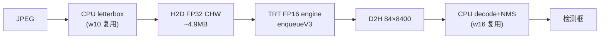

# trt — TensorRT C++ Engine（M1：FP16 跑通）

上游 spec：`docs/superpowers/specs/2026-07-06-trt-design.md`
四路对比报告：`docs/benchmarks/trt_engine_report.md`

## 数据流（M1/M2 形态：前后处理在 CPU，测纯 infer）



M3 将切到全 GPU 流水线（H2D 上行缩小 ~5×，NMS 融进 engine），见 spec §5。

## M1 设计决策

- **错误风格**：抛 `std::runtime_error`（对齐 w16/quant，实施前核对过，非
  `std::expected`）；CUDA 调用全走 `TRT_CUDA_CHECK` 宏，显式报错不静默。
- **engine 缓存戳**：模型 FNV-1a 哈希 + `getInferLibVersion()` + 精度 + SM
  架构全部编入文件名——任一变化文件名即变，未命中自动重建，无 sidecar 元数据。
- **动态维度**：yolov8n.onnx 是全动态导出（batch/height/width 符号维），
  build 期挂单 optimization profile（min=opt=max=1×3×640×640）锁死；运行时
  经 `getProfileShape` → `setInputShape` → context 级 `getTensorShape` 解析
  具体形状。
- **RAII**：TRT 10 接口支持直接 delete，`unique_ptr` 即可；`TrtEngine` 成员
  按 runtime→engine→context 声明，析构逆序天然满足 TRT 依赖顺序。
- **基准口径**：纯 infer 含 H2D/D2H 与同步，对齐 ORT `Run()`（CUDA EP 的
  5.64ms 同样含内部拷贝），保证四路表同口径可比。
- **M1 不编 .cu**：GPU buffer 用 cudart 主机 API；nvcc(+g++-12) 方案已冒烟
  验证，`enable_language(CUDA)` 留到 M3。

## 编译 / 运行

```bash
cmake --build build-gpu --target trt_engine_test trt_consistency_test trt_benchmark -j$(nproc)
ctest --test-dir build-gpu -R "Trt_" --output-on-failure
./build-gpu/02_Inference_Analysis/tensorrt/trt_benchmark
```

首次跑 engine 构建 1~4 分钟（落盘缓存 `build-gpu/.../engine_cache/`），之后秒级。

## M1 实测

# trt M1 Benchmark（TRT FP16 纯 infer）

- image: `/home/dev/code/Edge-AI-Genesis-2026/02_Inference_Analysis/w16_yolo_detector/models/test_image.jpg`
- engine: `/home/dev/code/Edge-AI-Genesis-2026/build-gpu/02_Inference_Analysis/tensorrt/engine_cache/yolov8n.fp16.sm86.trt101601.c5b83881eefdfd90.plan`（8.9 MB）
- 口径: 含 H2D/D2H 与 stream 同步（对齐 ORT Run），warmup=5 iters=20

| 路线 | P50(ms) | P99(ms) | FPS |
|---|---:|---:|---:|
| CUDA EP FP32（quant 同机引用） | 5.64 | — | 177.3 |
| TRT FP16（实测） | 2.93 | 3.74 | 341.1 |

> TRT FP16 vs CUDA EP FP32: -48.0%（负值 = TRT 更快）

4 次运行 P50 稳定在 2.93~3.01ms；P99 3.74~4.76ms 有笔记本 GPU 热漂移抖动，不影响结论。
