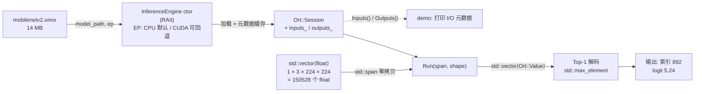
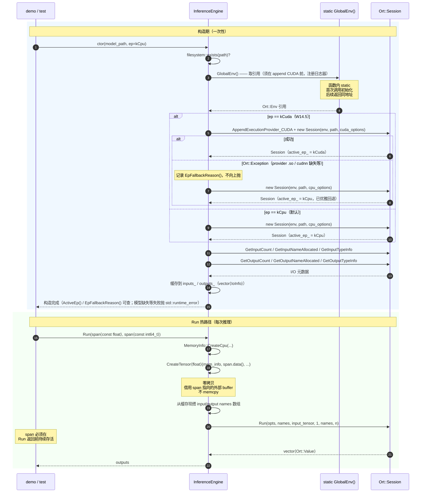

# W14 — ONNX Runtime C++ 基础闭环

> Q2 起点。本周走 B 路径：本地 CPU 单环境 + MobileNetV2 端到端闭环。
> CUDA EP 已在 W14.5 补齐（见下方「待补」与 W14.5 节）；ResNet18 对比仍待。

## 闭环结果

| 项 | 实际值 |
|---|---|
| ORT 版本 | 1.26.0（CPU 包 onnxruntime-linux-x64；GPU 包 onnxruntime-linux-x64-gpu） |
| ExecutionProvider | CPU（默认）/ CUDA（可选，W14.5 加入）；`ActiveEp()` 查实际生效 |
| 模型 | MobileNetV2（ONNX Model Zoo，14MB） |
| 输入 | `[1,3,224,224] float32`（动态 batch 解析为 1） |
| 输出 | `[1,1000] float32`，Top-1 索引 892（随机输入下无语义） |
| 单测 | 8 个全绿（基础 5 + W14.5：DefaultConstructionUsesCpu / CudaRequestFallsBackGracefully / LoadsModelWithCudaEp） |
| 单次推理耗时 | **CPU avg 2.74ms / min 2.16ms**；**CUDA avg 2.02ms / min 1.57ms**（i5-12500H + RTX 3060 Laptop，预热 20 + 计时 100，`w14_inference_benchmark`） |

> **GPU 只快 ~1.3×？正常**：MobileNetV2 太小 + batch=1，kernel 启动与 Host→Device 拷贝开销占比大，GPU 算力喂不饱；ORT 还会把部分 shape 算子留在 CPU（host-device 同步）。GPU 优势要在**大 batch / 大模型 / 高吞吐**场景才显现。旧 notes 记的「~30ms CPU」是测试墙钟时间、非纯推理延迟，已用 benchmark 实测值更正。

## 编译与运行

> 均在仓库根目录执行；首次配置见 `README.md` Quick Start。ORT 库路径已写进
> 各目标的 `BUILD_RPATH`，无需 `LD_LIBRARY_PATH`。模型默认路径已内置（缺失时
> demo/benchmark 仍能跑元数据、单测 `GTEST_SKIP()`）。

> **CPU 与 CUDA 是两套独立产物，别混用。** CPU 包（默认 `onnxruntime-linux-x64-1.26.0`）
> 不含 `libonnxruntime_providers_cuda.so`，CUDA EP 实现库只在 GPU 包里。两套各用一个
> build 目录（`build` / `build-gpu`），由配置时的 `ONNXRUNTIME_ROOT` 决定链接哪个包。
> **配置、编译、运行三步的目录必须前后一致**——只改配置那步、编译/运行还用 `build`，
> 跑出来仍是 CPU（`--cuda` 必然回退，报 "Failed to load shared library"）。这是高频坑。

### CPU 版（默认）

```bash
# 1) 配置（首次，或改了 CMakeLists 后重跑）
cmake -B build -S . -DCMAKE_CXX_COMPILER=g++-15 -G Ninja

# 2) 编译：库 / demo / benchmark（库被后两者自动带出）
cmake --build build --target w14_ort_basics_demo w14_inference_benchmark -j$(nproc)

# 3) 运行（二进制在 build/02_Inference_Analysis/w14_ort_basics/ 下）
./build/02_Inference_Analysis/w14_ort_basics/w14_ort_basics_demo                     # 打印 I/O 元数据 + Top-1
./build/02_Inference_Analysis/w14_ort_basics/w14_ort_basics_demo --model <path.onnx> # 换模型
./build/02_Inference_Analysis/w14_ort_basics/w14_inference_benchmark                 # 预热 + 多次计时取均值

# 单测
cmake --build build --target w14_inference_engine_test -j$(nproc)
ctest --test-dir build -R "W14_" --output-on-failure
```

### CUDA 版（需 GPU 包 + 可用的 CUDA/cuDNN）

> 与 CPU 版唯一差别：配置时 `-DONNXRUNTIME_ROOT` 指到 **GPU 包**，且全程用 `build-gpu`。
> 验证成功的标志是 demo 打印 `[W14] 实际 EP: CUDA`（回退则打印 CPU + 回退原因）。

```bash
# 1) 配置 —— 指向 GPU 包，输出到独立的 build-gpu（与 CPU 的 build 并存）
cmake -B build-gpu -S . -DCMAKE_CXX_COMPILER=g++-15 -G Ninja \
  -DONNXRUNTIME_ROOT="$PWD/third_party/onnxruntime/onnxruntime-linux-x64-gpu-1.26.0"

# 2) 编译 —— 注意是 build-gpu，不是 build
cmake --build build-gpu --target w14_ort_basics_demo w14_inference_benchmark -j$(nproc)

# 3) 运行 —— 路径也是 build-gpu，加 --cuda 才真上 GPU
./build-gpu/02_Inference_Analysis/w14_ort_basics/w14_ort_basics_demo --cuda          # 期望: 实际 EP: CUDA
./build-gpu/02_Inference_Analysis/w14_ort_basics/w14_inference_benchmark --cuda --warmup 20 --iters 100
```

### 命令解读：两条 cmake 是「配置」和「编译」两个阶段

> 日常只想再跑程序、源码没动时，**前两条 cmake 都不用执行**，直接跑 `$BIN/...`。
> 配置只做一次；改了源码才需重新编译（Ninja 增量，没改秒回 `ninja: no work to do`）。

| 阶段 | 命令 | 干什么 | 何时重跑 |
|---|---|---|---|
| **配置** | `cmake -B build -S .` | 探测编译器、解析 `CMakeLists.txt`、生成 Ninja 脚本 | 改了 `CMakeLists.txt` 或换 CPU/GPU 包 |
| **编译** | `cmake --build build` | 真正调 g++ 把 `.cpp` 编成二进制 | 改了 `.cpp`/`.hpp` |

**配置阶段参数**（`cmake -B build -S . -DCMAKE_CXX_COMPILER=g++-15 -G Ninja`）：

- `-S .` — **S**ource，源码根目录（`.` = 仓库根，含顶层 `CMakeLists.txt`）
- `-B build` — **B**uild，生成物/二进制的输出目录（换名即另起一份，CPU/GPU 互不覆盖）
- `-D<名>=<值>` — **D**efine，设一个 CMake 变量；下面两个都是 `-D`
  - `-DCMAKE_CXX_COMPILER=g++-15` — 指定编译器（项目要求，C++20/23 特性需要）
  - `-DONNXRUNTIME_ROOT=<gpu 包路径>` — 项目自定义变量（`CMakeLists.txt:20` 定义）；**不写=默认 CPU 包**，写 gpu 包路径才链接 GPU 版，是 CPU/GPU 唯一差别
- `-G Ninja` — **G**enerator，生成 Ninja 构建脚本（项目强制，C++20 具名模块不支持 Makefiles）

**编译阶段参数**（`cmake --build build --target <名...> -j$(nproc)`）：

- `--build build` — 对已配置好的 `build/` 执行编译（注意与配置的 `-B build` 区分：一个建目录、一个进去施工）
- `--target <名...>` — 只编指定目标（名字来自 `add_executable`/`add_library`），不加则编全部
- `-j$(nproc)` — 并行编译，`$(nproc)` 自动取 CPU 核数

## 概念澄清：ONNX / ORT / 图像处理 / 图像识别

> 跨周可复用概念（ONNX vs ORT、tensor/Ort::Value、Env/Session、零拷贝、EP 回退、
> CPU/GPU 内存等）已毕业进主题库 [`docs/notes/inference.md`](../../docs/notes/inference.md)；
> `static`/`ABI` 见 [`docs/notes/cpp-core.md`](../../docs/notes/cpp-core.md)。本节及下方设计决策保留 W14 模块语境。

W14 最容易混淆的是四个词：ONNX、ORT、图像处理、图像识别。它们不是一回事，
而是处在同一条推理链路的不同位置：

```text
原始图片
  -> 图像处理 / 前处理（Resize、HWC2CHW、Normalize）
  -> 输入 tensor（float buffer）
  -> ORT 加载并执行 ONNX 模型
  -> 输出 tensor
  -> 后处理（Top-K / NMS / label 映射）
  -> 图像识别结果
```

- **ONNX 是模型文件格式**：`.onnx` 文件里保存模型结构、权重、输入输出
  名称、shape 和数据类型。它不是图像处理库，也不是推理引擎。
- **ORT 是 ONNX Runtime**：负责加载 `.onnx` 文件，执行里面的 Conv / Relu /
  Pool / MatMul 等算子，并把输入 tensor 变成输出 tensor。
- **图像处理是模型前后的数据整理**：例如把 `jpg/png` 解码后 resize 到
  `224x224`，做 RGB / BGR 转换、HWC 到 CHW 转换、Normalize，再把结果装成
  float buffer。W15 会重点做这一段。
- **图像识别是模型任务结果**：MobileNetV2 的任务是图像分类，所以输出
  `[1,1000]` 后可以做 Top-1 / Top-5 解码。但 ORT 本身并不只服务图像识别；
  YOLO 是目标检测，UNet 是分割，Whisper 是语音，BERT 是文本。

因此，W14 的真正目标不是做完整图像识别 App，而是先完成中间的 C++ 推理
基础闭环：`float buffer -> ORT -> output tensor`。等 W15 补上前处理和后处理后，
才会形成完整的 `图片 -> 识别结果` 链路。

## 架构与时序

### 端到端数据流（demo 视角）



### InferenceEngine 生命周期（构造 + Run 时序）



---

## 关键设计决策

### 1. `Ort::Env` 全局唯一 —— 函数内 static

```cpp
Ort::Env& InferenceEngine::GlobalEnv() {
  static Ort::Env env(ORT_LOGGING_LEVEL_WARNING, "EdgeAI-W14");
  return env;
}
```

- **`Ort::Env` 是什么**：ORT 的进程级运行环境，持有**日志器 + 内部线程池/分配器**
  （不只是日志），是创建 `Ort::Session` 的必需入参。它是「环境」不是「模型」，
  一个 Env 可被多个 Session 共用。
- **为什么必须唯一**：多份并存会重复分配数百 KB，且多个日志器同时写会交错混乱。
  ORT 官方建议一个进程一个 Env、所有 Session 共享。
- **为什么用函数内 static**：C++11+ 保证线程安全 + 仅初始化一次 + 程序退出时析构；
  比全局变量更安全（无静态初始化顺序问题），比手工单例更精简。返回引用（非拷贝），
  拿到的是本体。
- **测试如何验证**：`&GlobalEnv() == &GlobalEnv()` 地址相等即证明单例。
- **隐藏职责：必须在 append CUDA 之前先建 Env**。`Ort::Env` 构造时会注册进程级
  默认日志器，而 `AppendExecutionProvider_CUDA` 内部要用这个日志器。所以构造函数里
  `Ort::Env& env = GlobalEnv();` 这行必须排在 CUDA 逻辑之前——否则 append 时
  日志器尚未注册，抛 "DefaultLogger but none registered"，导致 **CUDA 可用却被误判
  失败、回退 CPU**（详见下方「W14.5 两个值得记的坑」第 2 点，commit 319d4ae 修）。
  这也是 GlobalEnv() 除「提供唯一 Env」外的第二重作用：**确保日志器已就绪**。

### 2. 零拷贝输入 —— `CreateTensorWithDataAsOrtValue`

```cpp
Ort::Value::CreateTensor<float>(mem_info,
                                const_cast<float*>(input.data()),
                                input.size(),
                                shape.data(),
                                shape.size());
```

- **零拷贝语义**：ORT C API 是"借用外部 buffer"，不复制；
  调用方必须保证 buffer 在 `Run` 返回前存活。
- **`std::span<const float>` 输入承诺只读**：内部 `const_cast` 是为了
  对接 C ABI（Application Binary Interface，二进制接口：预编译的 C 库在二进制
  层面把参数写死为 `T*` 非 const，区别于源码层面的 API），ORT 推理路径实际只读。
- **W14 单输入简化**：`Run(span, shape)` 单输入版本足够覆盖分类模型；
  多输入（YOLO 多输出头）留到 W15 / W16 扩展。

### 3. I/O 元数据构造期一次性缓存

`session_->GetInputNameAllocated / GetInputTypeInfo` 都会走 ORT 内部分配。
构造期一次性查完缓存到 `inputs_` / `outputs_`（`std::vector<IoInfo>`），
`Run` 热路径只用缓存。

代价：每次 `Run` 仍要现搭一次 `std::vector<const char*>` 给 ORT 的 Run 签名；
单次推理两次小 vector 分配相对毫秒级推理可忽略，换 API 简洁度值得。

### 4. 测试模型路径 —— CMake 编译期常量

```cmake
target_compile_definitions(w14_inference_engine_test
  PRIVATE W14_MODEL_PATH="${CMAKE_CURRENT_SOURCE_DIR}/models/mobilenetv2.onnx")
```

- 测试拿到绝对路径，不依赖 ctest 工作目录
- 模型缺失时用 `GTEST_SKIP()` 优雅跳过，CI / 新机器初次拉代码不报红

## 踩坑

### 坑 1：ORT 1.26 预编译包 `onnxruntimeConfig.cmake` packaging bug

上游导出文件硬编码 `lib64/libonnxruntime.so.1.26.0`，但实际 tarball 是 `lib/`。
`find_package(onnxruntime CONFIG REQUIRED)` 直接报"installation package was faulty"。

**解法**：绕开 `find_package`，手工 `add_library(onnxruntime::onnxruntime SHARED IMPORTED)`
+ `set_target_properties(... IMPORTED_LOCATION ... INTERFACE_INCLUDE_DIRECTORIES ...)`。
显式、不受上游修复节奏影响。

### 坑 2：版本查询 API 名误记

最初写成 `Ort::GetApi().GetVersionString()` —— `OrtApi` 没有这个成员。
正确 API 是顶层 `Ort::GetVersionString()` 返回 `std::string`。
教训：1.26 头里 `grep -nE` 直接确认签名再写，比靠记忆稳。

### 坑 3：RPATH 缺失会强制 `LD_LIBRARY_PATH`

ORT 在 `third_party/` 下，不在系统 lib 路径里。
`set_target_properties(... BUILD_RPATH "${ONNXRUNTIME_ROOT}/lib")` 让二进制
直接知道库位置，免去每次跑 demo / test 都要 `LD_LIBRARY_PATH=... ./...`。

## 待补

> CUDA EP 及其单测已在 W14.5 完成（见下方「W14.5 两个值得记的坑」与上方设计/时序）。

- **ResNet18 对比 — 降级为可选，默认不做。** 它的唯一价值是「证明 `InferenceEngine`
  不挑模型」，而这点已被 W15（MobileNetV2 真实图端到端，Samoyed 0.65）+ W16（YOLO
  多输出、架构完全不同）更强地覆盖；且需装 ~800MB torch 仅为再导一个分类模型，
  投入产出不划算。如将来确需第二个分类基线再补，引擎已支持任意 ONNX，加测试用例即可。
- **VPS CPU EP 环境搭建 — 仍待定。** 不卡后续（EP 对比在 W17 / Q3），时机到再搭，
  届时沉淀到 README 双环境节。

### W14.5 两个值得记的坑

1. **CUDA toolkit 在 Ubuntu 24.04 装不上 `cuda-toolkit-12-3`**：它依赖旧版
   nsight-systems → `libtinfo5`，而 24.04 已废弃 libtinfo5（"held broken packages"）。
   解法：装精简 meta `cuda-compiler-12-3 + cuda-libraries{,-dev}-12-3 + cudnn9-cuda-12`，
   含 nvcc + 全库，跳过 profiler。W16 要 profiling 时单装支持 24.04 的新版 nsight
   （依赖 libtinfo6），与现有 CUDA 12.3 runtime 并存，零代价。
2. **CUDA EP 误回退的顺序依赖假绿**：`AppendExecutionProvider_CUDA` 内部用 ORT 默认
   日志器，必须在 append 前先创建 `Ort::Env`（GlobalEnv）注册日志器。否则进程内首次
   构造 CUDA 引擎会抛 "DefaultLogger but none registered" → CUDA 可用却误回退 CPU。
   单测因前序用例已建 Env 而侥幸通过，是 demo 单次构造暴露的真相（commit 319d4ae 修）。
