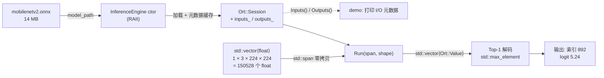
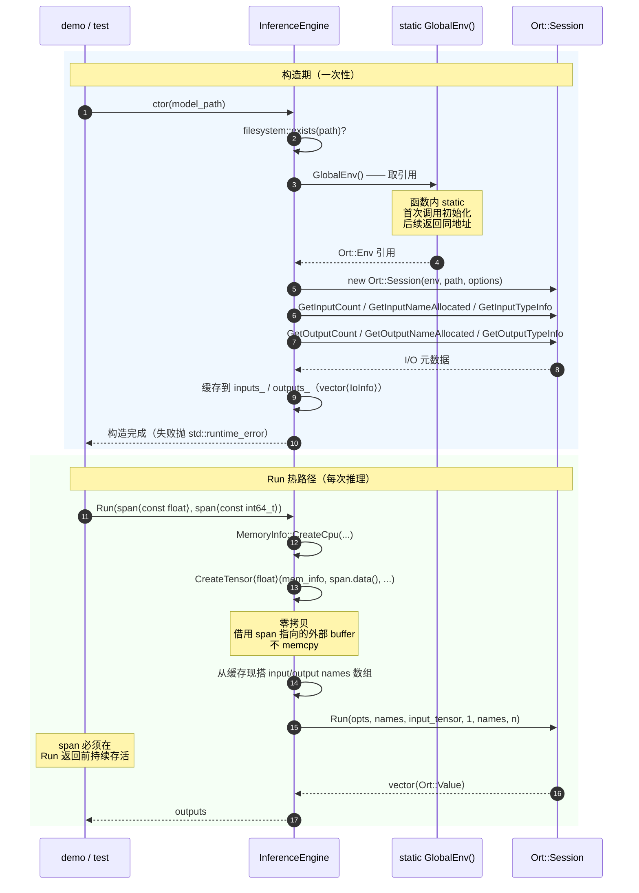

# W14 — ONNX Runtime C++ 基础闭环

> Q2 起点。完成本地 CPU 单环境 + MobileNetV2 端到端闭环。
> CUDA EP / ResNet18 / 完整 5 个单测的 CUDA 变体推至 W14.5 或 W15 启动时补。

## 闭环结果

| 项 | 实际值 |
|---|---|
| ORT 版本 | 1.26.0（预编译包 onnxruntime-linux-x64） |
| ExecutionProvider | CPU（默认） |
| 模型 | MobileNetV2（ONNX Model Zoo，14MB） |
| 输入 | `[1,3,224,224] float32`（动态 batch 解析为 1） |
| 输出 | `[1,1000] float32`，Top-1 索引 892（随机输入下无语义） |
| 单测 | 5 个全绿（LoadsModel / QueriesIoMetadata / RunsZeroCopyInference / FailsOnMissingModel / EnvIsSingleton） |
| 单次推理耗时 | ~30ms（CPU，含 RunsZeroCopyInference 测试时序） |

## 概念澄清：ONNX / ORT / 图像处理 / 图像识别

W14 最容易混淆的是四个词：ONNX、ORT、图像处理、图像识别。它们不是一回事，
而是处在同一条推理链路的不同位置：

```text
原始图片
  -> 图像处理 / 前处理（Resize、HWC2CHW、Normalize）
  -> 输入 tensor（float buffer）
  -> ORT 加载并执行 ONNX 模型
  -> 输出 tensor
  -> 后处理（Top-K / NMS / label 映射）
  -> 图像识别结果
```

- **ONNX 是模型文件格式**：`.onnx` 文件里保存模型结构、权重、输入输出
  名称、shape 和数据类型。它不是图像处理库，也不是推理引擎。
- **ORT 是 ONNX Runtime**：负责加载 `.onnx` 文件，执行里面的 Conv / Relu /
  Pool / MatMul 等算子，并把输入 tensor 变成输出 tensor。
- **图像处理是模型前后的数据整理**：例如把 `jpg/png` 解码后 resize 到
  `224x224`，做 RGB / BGR 转换、HWC 到 CHW 转换、Normalize，再把结果装成
  float buffer。W15 会重点做这一段。
- **图像识别是模型任务结果**：MobileNetV2 的任务是图像分类，所以输出
  `[1,1000]` 后可以做 Top-1 / Top-5 解码。但 ORT 本身并不只服务图像识别；
  YOLO 是目标检测，UNet 是分割，Whisper 是语音，BERT 是文本。

因此，W14 的真正目标不是做完整图像识别 App，而是先完成中间的 C++ 推理
基础闭环：`float buffer -> ORT -> output tensor`。等 W15 补上前处理和后处理后，
才会形成完整的 `图片 -> 识别结果` 链路。

## 架构与时序

### 端到端数据流（demo 视角）



### InferenceEngine 生命周期（构造 + Run 时序）



---

## 关键设计决策

### 1. `Ort::Env` 全局唯一 —— 函数内 static

```cpp
Ort::Env& InferenceEngine::GlobalEnv() {
  static Ort::Env env(ORT_LOGGING_LEVEL_WARNING, "EdgeAI-W14");
  return env;
}
```

- **为什么必须唯一**：`Ort::Env` 持有进程级日志器 + 内部线程池资源；
  多份并存会重复分配数百 KB，且日志输出会交错混乱。
- **为什么用函数内 static**：C++11+ 保证线程安全 + 仅初始化一次 + 程序退出时析构；
  比全局变量更安全（无静态初始化顺序问题），比手工单例更精简。
- **测试如何验证**：`&GlobalEnv() == &GlobalEnv()` 地址相等即证明单例。

### 2. 零拷贝输入 —— `CreateTensorWithDataAsOrtValue`

```cpp
Ort::Value::CreateTensor<float>(mem_info,
                                const_cast<float*>(input.data()),
                                input.size(),
                                shape.data(),
                                shape.size());
```

- **零拷贝语义**：ORT C API 是"借用外部 buffer"，不复制；
  调用方必须保证 buffer 在 `Run` 返回前存活。
- **`std::span<const float>` 输入承诺只读**：内部 `const_cast` 是为了
  对接 C ABI（CreateTensor 参数声明为 `T*`），ORT 推理路径实际只读。
- **W14 单输入简化**：`Run(span, shape)` 单输入版本足够覆盖分类模型；
  多输入（YOLO 多输出头）留到 W15 / W16 扩展。

### 3. I/O 元数据构造期一次性缓存

`session_->GetInputNameAllocated / GetInputTypeInfo` 都会走 ORT 内部分配。
构造期一次性查完缓存到 `inputs_` / `outputs_`（`std::vector<IoInfo>`），
`Run` 热路径只用缓存。

代价：每次 `Run` 仍要现搭一次 `std::vector<const char*>` 给 ORT 的 Run 签名；
单次推理两次小 vector 分配相对毫秒级推理可忽略，换 API 简洁度值得。

### 4. 测试模型路径 —— CMake 编译期常量

```cmake
target_compile_definitions(w14_inference_engine_test
  PRIVATE W14_MODEL_PATH="${CMAKE_CURRENT_SOURCE_DIR}/models/mobilenetv2.onnx")
```

- 测试拿到绝对路径，不依赖 ctest 工作目录
- 模型缺失时用 `GTEST_SKIP()` 优雅跳过，CI / 新机器初次拉代码不报红

## 踩坑

### 坑 1：ORT 1.26 预编译包 `onnxruntimeConfig.cmake` packaging bug

上游导出文件硬编码 `lib64/libonnxruntime.so.1.26.0`，但实际 tarball 是 `lib/`。
`find_package(onnxruntime CONFIG REQUIRED)` 直接报"installation package was faulty"。

**解法**：绕开 `find_package`，手工 `add_library(onnxruntime::onnxruntime SHARED IMPORTED)`
+ `set_target_properties(... IMPORTED_LOCATION ... INTERFACE_INCLUDE_DIRECTORIES ...)`。
显式、不受上游修复节奏影响。

### 坑 2：版本查询 API 名误记

最初写成 `Ort::GetApi().GetVersionString()` —— `OrtApi` 没有这个成员。
正确 API 是顶层 `Ort::GetVersionString()` 返回 `std::string`。
教训：1.26 头里 `grep -nE` 直接确认签名再写，比靠记忆稳。

### 坑 3：RPATH 缺失会强制 `LD_LIBRARY_PATH`

ORT 在 `third_party/` 下，不在系统 lib 路径里。
`set_target_properties(... BUILD_RPATH "${ONNXRUNTIME_ROOT}/lib")` 让二进制
直接知道库位置，免去每次跑 demo / test 都要 `LD_LIBRARY_PATH=... ./...`。

## 待补（W14.5 / W15）

- CUDA EP（需先装 CUDA Toolkit 12.x for WSL + cuDNN 9 + 下 `onnxruntime-linux-x64-gpu` 包）
- ResNet18 对比（需 torch 导出，本周裁剪掉）
- `LoadsModelWithCudaEp` 单测（依赖上面 CUDA 接入）
- VPS CPU EP 环境搭建（W15 起手做）
