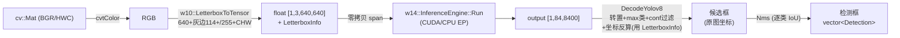
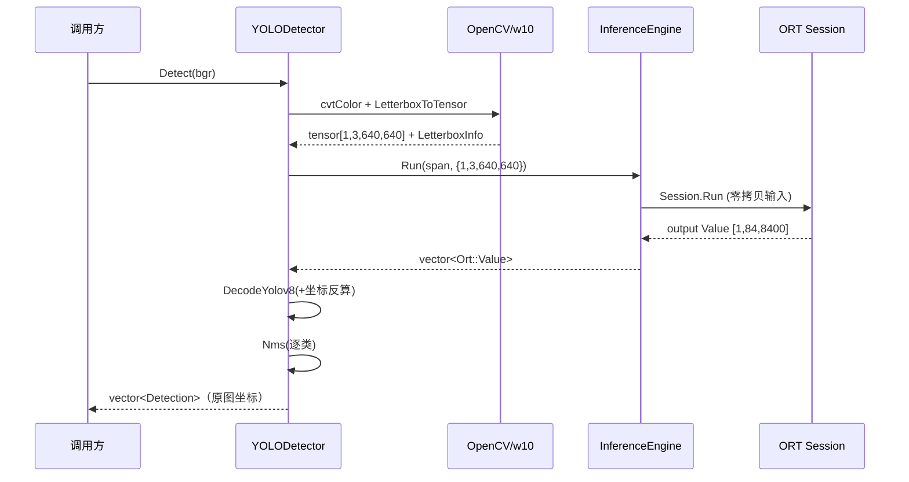

# W16 — YOLOv8n 检测 Demo（多输出头 + NMS + 坐标反算）

> Q2 第三步。把 W15 的「分类单输出」升级为「检测多框输出」：YOLOv8 检测头解析、
> 手写 NMS、letterbox 坐标反算，端到端对拍 ultralytics。
> 复用 W14 `InferenceEngine`（推理）+ Q1 W10 `LetterboxToTensor`（预处理）。
>
> 通用概念去主题库：NMS/IoU、YOLOv8 检测头布局见 [`docs/notes/inference.md`](../../docs/notes/inference.md)；
> Letterbox + 坐标反算见 [`docs/notes/image-ops.md`](../../docs/notes/image-ops.md)。本笔记只留本模块怎么用 + 设计/踩坑/测试。

## 闭环结果

| 项 | 实际值 |
|---|---|
| 模型 | YOLOv8n（ultralytics 导出 onnx，opset17，动态 batch + 动态 H/W） |
| 输入 | `[1,3,640,640] float32`，BGR→RGB→letterbox(灰边114)→/255→CHW |
| 输出头 | `[1,84,8400]`：84 = 4 box(cxcywh) + 80 类，**无 objectness**（与 v5 不同） |
| 后处理 | 转置逐 anchor → max 类概率 → conf 过滤 → cxcywh→xyxy → 坐标反算 → 逐类 NMS |
| 测试图 | ultralytics 样图 `bus.jpg` |
| **端到端输出** | 4 person + 1 bus（方形 640 letterbox），逐框 score 与 ultralytics 对齐到 **<0.001** |

## 数据流（Mermaid）



## 时序图（Detect 调用 + Session 生命周期）



## 本模块设计决策

1. **后处理核心与 ORT/OpenCV 解耦**：`nms` + `decode` 编进纯 C++ 的 `w16_detect_core` 库
   （不依赖 ORT/OpenCV），可独立单测——逐类 NMS 与坐标反算是检测里最高 bug 风险点，隔离测最稳。
   `DecodeYolov8` 用裸 `scale/pad_left/pad_top`（= `w10::LetterboxInfo` 三字段）而非 w10 结构体，
   正是为了不把 OpenCV 拖进解码核心。
2. **组合而非继承 W14**：`YOLODetector` 持有 `w14::InferenceEngine` 成员。InferenceEngine 无虚函数、
   非为继承设计，组合边界更清晰。（概念见 inference.md「Env/Session/Engine」）
3. **预处理复用 Q1 W10**：`LetterboxToTensor` 自带 `/255`（无 mean/std，正合 YOLOv8）+ `LetterboxInfo`，
   直接拿来用。关键：它按输入通道顺序展平，故必须**先 `cvtColor` BGR→RGB 再喂入**（YOLOv8 按 RGB 训练）。
4. **检测数从输出形状动态推断**：`num_classes = shape[1] - 4`、`num_anchors = shape[2]`，
   不写死，换 80 类外的模型也能跑。

## 模块结构

```
w16_yolo_detector/
  detection.hpp          # Detection 结构（nms/decode 共享）
  nms.{hpp,cpp}          # IoU + 逐类 Nms（纯 C++）
  decode.{hpp,cpp}       # DecodeYolov8：转置+阈值+坐标反算（纯 C++）
  yolo_detector.{hpp,cpp}# YOLODetector 编排（组合 W14 + w10 + core）
  yolo_demo.cpp          # ./w16_yolo_demo [img] [model] 画框存图 w16_output.jpg
  tools/export_yolov8n.py# ultralytics 导出 onnx + 标签 + 测试图
  tools/gen_reference.py # 跑 onnx 生成对拍基准 reference_detections.txt
  models/                # yolov8n.onnx, coco_classes.txt, test_image.jpg, reference_*.txt
```

## 踩坑（带 commit）

- **对拍失败 = 矩形 vs 方形 letterbox**（本批提交）：动态 H/W 的 onnx 让 ultralytics 默认走
  **矩形推理**（如 640×480 无填充），而 C++ 端固定方形 640×640（带灰边）。两端对高分目标差异可忽略，
  但临界框（score≈0.25）会改变检测数量，导致框数对不齐。`gen_reference.py` 强制 `rect=False`
  后两端逐框 score 对齐到 <0.001——**对拍前必须确认两端 letterbox 范式一致**。
- **NMS <1ms 是 Release 指标**：1000 框 stress test 在 Debug/ASAN 下会超预算，单测用 `#ifdef NDEBUG`
  分流（Release 严格 <1ms，Debug 放宽 20ms），避免无优化带来的假阴性。
- **YOLOv8 无 objectness**：输出 `[1,84,8400]` 的 84 = 4+80，**没有**第 5 维置信度（v5 才有）；
  score 直接取 80 类最大值。布局是 channels-major，解码前需按 `out[ch*A+a]` 转置遍历。

## 测试 / 基准

| 测试目标 | 内容 | 状态 |
|---|---|---|
| `W16_NmsTest` | IoU 手算对拍、重叠抑制、跨类不抑制、降序、1000 框 stress<1ms | ✅ 6 例 |
| `W16_DecodeTest` | 合成张量解码、conf 过滤、**坐标反算<1px（一等指标）**、错误尺寸抛异常 | ✅ 4 例 |
| `W16_DetectorTest` | 真图端到端对拍 ultralytics（框数一致 + 每框 IoU>0.9 同类 + score<0.05），模型缺失则 SKIP | ✅ |

```bash
ctest --test-dir build -R "W16_" --output-on-failure   # 3 个全绿
```

## 编译运行命令

```bash
# 准备模型与对拍基准（一次性，需 venv：见 README 前提条件）
. .venv/bin/activate
cd 02_Inference_Analysis/w16_yolo_detector
python tools/export_yolov8n.py   # 导出 onnx + 标签 + 测试图
python tools/gen_reference.py    # 生成 reference_detections.txt

# 编译 + 跑 demo（默认 CUDA EP，不可用回退 CPU）
cmake --build build --target w16_yolo_demo
./build/02_Inference_Analysis/w16_yolo_detector/w16_yolo_demo
```

## 与下一步衔接

- **Step 5（ORT 进阶，本周后半）**：扩展 W14 加 IntraOp/InterOp 线程配置 + IOBinding，
  `yolo_benchmark` 出 batch 1 vs 4 × {CPU,CUDA,±IOBinding} 的 P50/P99（带 warmup）。
- **W17**：把 W14–W16 整合为 `inference_engine` 库 + 单测；导出 ResNet18（YOLO 已在 W16 导出）。
- **W18**：对本周 YOLO 程序做专业 Profiling（Nsight/Roofline），与 W16 的工程快测互补。
