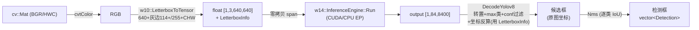
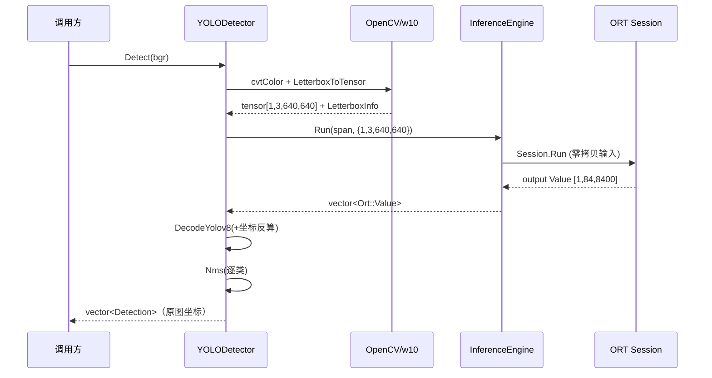

# W16 — YOLOv8n 检测 Demo（多输出头 + NMS + 坐标反算）

> Q2 第三步。把 W15 的「分类单输出」升级为「检测多框输出」：YOLOv8 检测头解析、
> 手写 NMS、letterbox 坐标反算，端到端对拍 ultralytics。
> 复用 W14 `InferenceEngine`（推理）+ Q1 W10 `LetterboxToTensor`（预处理）。
>
> 通用概念去主题库：NMS/IoU、YOLOv8 检测头布局见 [`docs/notes/inference.md`](../../docs/notes/inference.md)；
> Letterbox + 坐标反算见 [`docs/notes/image-ops.md`](../../docs/notes/image-ops.md)。本笔记只留本模块怎么用 + 设计/踩坑/测试。

## 复习小抄（一个框的完整旅程 + 易混点）

> 后处理三件套 = 解码 → 坐标反算 → NMS。下图把整条链 + 两个易混点串成一张图，复习时先看这里。

```
原图 cv::Mat 810×1080 (BGR/HWC)
  │ ① cvtColor BGR→RGB（YOLOv8 按 RGB 训练，顺序反了全错，且不报错）
  ▼
RGB 图
  │ ② Letterbox（复用 W10）：等比缩放 scale + 四周补灰边 114 + ÷255 + HWC→CHW
  │   产出 LetterboxInfo{scale, pad_left, pad_top} ← 存好，坐标反算要用
  ▼
张量 [1,3,640,640] float32
  │ ③ InferenceEngine.Run（W14，CUDA/CPU EP，零拷贝喂进 ORT Session）
  ▼
输出 [1,84,8400]  ← 84 = 4 框坐标 + 80 类（无 objectness）；8400 = 所有格子的预测；坐标在「方形图系」
  │ ④ Decode（纯 C++ core）：channels-major 转置逐 anchor → 取 80 类 max = score+class_id
  │   → conf 阈值筛低分（不看类别，只看够不够自信）→ cxcywh→xyxy
  │   → 坐标反算 orig=(lb-pad)/scale（先减 pad 再除 scale，顺序不能反）
  ▼
几百个候选框（已是「原图坐标」）
  │ ⑤ NMS（纯 C++ core，逐类）：按 score 降序，留最高分、删与它 IoU>阈值的「同类」框
  │   人和人去重、车和车去重，跨类不碰
  ▼
4 person + 1 bus（原图坐标，可直接画框）— 对拍 ultralytics 逐框 <0.001 ✅
```

**两个阈值旋钮（别混）**

| 旋钮 | 在哪步 | 管什么 | 关键 |
|---|---|---|---|
| conf 阈值 | Decode（④） | 筛掉「模型没把握」的框 | **不看类别**，只看自信分够不够 |
| iou 阈值 | NMS（⑤） | 重叠多少算重复、删一个 | **大于**阈值才删；越小删越狠 |

**两套坐标系（靠坐标反算连接）**：方形图坐标系（模型输出）── `orig=(lb-pad)/scale` ──▶ 原图坐标系（最终画框）。
反算是检测最高 bug 风险点（框偏了不报错），靠 `<1px` 单测兜底。

**对拍铁律**：C++ 端方形 640 ⟺ ultralytics 也必须 `rect=False`。否则动态尺寸 onnx 让 ultralytics 默认走矩形推理（短边只补到 stride=32 的倍数、几乎不补灰边），与 C++ 全补边范式不一致 → 高分目标看不出、临界框（score≈0.25）翻车。

## 闭环结果

| 项 | 实际值 |
|---|---|
| 模型 | YOLOv8n（ultralytics 导出 onnx，opset17，动态 batch + 动态 H/W） |
| 输入 | `[1,3,640,640] float32`，BGR→RGB→letterbox(灰边114)→/255→CHW |
| 输出头 | `[1,84,8400]`：84 = 4 box(cxcywh) + 80 类，**无 objectness**（与 v5 不同） |
| 后处理 | 转置逐 anchor → max 类概率 → conf 过滤 → cxcywh→xyxy → 坐标反算 → 逐类 NMS |
| 测试图 | ultralytics 样图 `bus.jpg` |
| **端到端输出** | 4 person + 1 bus（方形 640 letterbox），逐框 score 与 ultralytics 对齐到 **<0.001** |

## 数据流（Mermaid）



## 时序图（Detect 调用 + Session 生命周期）



## 本模块设计决策

1. **后处理核心与 ORT/OpenCV 解耦**：`nms` + `decode` 编进纯 C++ 的 `w16_detect_core` 库
   （不依赖 ORT/OpenCV），可独立单测——逐类 NMS 与坐标反算是检测里最高 bug 风险点，隔离测最稳。
   `DecodeYolov8` 用裸 `scale/pad_left/pad_top`（= `w10::LetterboxInfo` 三字段）而非 w10 结构体，
   正是为了不把 OpenCV 拖进解码核心。
2. **组合而非继承 W14**：`YOLODetector` 持有 `w14::InferenceEngine` 成员。InferenceEngine 无虚函数、
   非为继承设计，组合边界更清晰。（概念见 inference.md「Env/Session/Engine」）
3. **预处理复用 Q1 W10**：`LetterboxToTensor` 自带 `/255`（无 mean/std，正合 YOLOv8）+ `LetterboxInfo`，
   直接拿来用。关键：它按输入通道顺序展平，故必须**先 `cvtColor` BGR→RGB 再喂入**（YOLOv8 按 RGB 训练）。
4. **检测数从输出形状动态推断**：`num_classes = shape[1] - 4`、`num_anchors = shape[2]`，
   不写死，换 80 类外的模型也能跑。

## 模块结构

```
w16_yolo_detector/
  detection.hpp          # Detection 结构（nms/decode 共享）
  nms.{hpp,cpp}          # IoU + 逐类 Nms（纯 C++）
  decode.{hpp,cpp}       # DecodeYolov8：转置+阈值+坐标反算（纯 C++）
  yolo_detector.{hpp,cpp}# YOLODetector 编排（组合 W14 + w10 + core）
  yolo_demo.cpp          # ./w16_yolo_demo [img] [model] 画框存图 w16_output.jpg
  yolo_benchmark.cpp     # batch 1v4 × {CPU,CUDA} × {Run,IOBinding} + IntraOp 扫描
  tools/export_yolov8n.py# ultralytics 导出 onnx + 标签 + 测试图
  tools/gen_reference.py # 跑 onnx 生成对拍基准 reference_detections.txt
  models/                # yolov8n.onnx, coco_classes.txt, test_image.jpg, reference_*.txt
```

## 踩坑（带 commit）

- **对拍失败 = 矩形 vs 方形 letterbox**（本批提交）：动态 H/W 的 onnx 让 ultralytics 默认走
  **矩形推理**（如 640×480 无填充），而 C++ 端固定方形 640×640（带灰边）。两端对高分目标差异可忽略，
  但临界框（score≈0.25）会改变检测数量，导致框数对不齐。`gen_reference.py` 强制 `rect=False`
  后两端逐框 score 对齐到 <0.001——**对拍前必须确认两端 letterbox 范式一致**。
- **NMS <1ms 是 Release 指标**：1000 框 stress test 在 Debug/ASAN 下会超预算，单测用 `#ifdef NDEBUG`
  分流（Release 严格 <1ms，Debug 放宽 20ms），避免无优化带来的假阴性。
- **YOLOv8 无 objectness**：输出 `[1,84,8400]` 的 84 = 4+80，**没有**第 5 维置信度（v5 才有）；
  score 直接取 80 类最大值。布局是 channels-major，解码前需按 `out[ch*A+a]` 转置遍历。

## 测试 / 基准

| 测试目标 | 内容 | 状态 |
|---|---|---|
| `W16_NmsTest` | IoU 手算对拍、重叠抑制、跨类不抑制、降序、1000 框 stress<1ms | ✅ 6 例 |
| `W16_DecodeTest` | 合成张量解码、conf 过滤、**坐标反算<1px（一等指标）**、错误尺寸抛异常 | ✅ 4 例 |
| `W16_DetectorTest` | 真图端到端对拍 ultralytics（框数一致 + 每框 IoU>0.9 同类 + score<0.05），模型缺失则 SKIP | ✅ |

```bash
ctest --test-dir build -R "W16_" --output-on-failure   # 3 个全绿
```

## 编译运行命令

```bash
# 准备模型与对拍基准（一次性，需 venv：见 README 前提条件）
. .venv/bin/activate
cd 02_Inference_Analysis/w16_yolo_detector
python tools/export_yolov8n.py   # 导出 onnx + 标签 + 测试图
python tools/gen_reference.py    # 生成 reference_detections.txt

# 编译 + 跑 demo（demo 代码默认请求 CUDA EP，加载失败则回退 CPU）
```

**CPU / CUDA 走两个独立 build 目录**——关键不在 demo 代码，而在该 build 配置时
`ONNXRUNTIME_ROOT` 指向哪个 ORT 包：CPU-only 包 `lib/` 里**没有**
`libonnxruntime_providers_cuda.so`，所以即便代码请求 CUDA 也只能回退 CPU。
两个目录并存、互不污染，便于 CPU/CUDA 对比基准。

```bash
# —— CPU 版（默认 ONNXRUNTIME_ROOT = onnxruntime-linux-x64-1.26.0，CPU-only 包）——
cmake -B build -S . -G Ninja -DCMAKE_CXX_COMPILER=g++-15
cmake --build build --target w16_yolo_demo
./build/02_Inference_Analysis/w16_yolo_detector/w16_yolo_demo          # EP=CPU

# —— CUDA 版（覆盖 ONNXRUNTIME_ROOT 指向 -gpu- 包，内含 cuda provider .so）——
cmake -B build-gpu -S . -G Ninja -DCMAKE_CXX_COMPILER=g++-15 \
  -DONNXRUNTIME_ROOT="$PWD/third_party/onnxruntime/onnxruntime-linux-x64-gpu-1.26.0"
cmake --build build-gpu --target w16_yolo_demo
./build-gpu/02_Inference_Analysis/w16_yolo_detector/w16_yolo_demo      # EP=CUDA
```

> 易错点：`cmake -B build-gpu` 后若仍 `cmake --build build`（漏改目录），编/跑的还是
> 旧 CPU 目录，现象是「配置成功却照样回退 CPU」。两处目录名必须一致。

## ORT 进阶（Step 5）+ 基准

加性扩展 W14 `InferenceEngine`（默认参数保持 W15/W16 零改动）：
- `SessionConfig{ep, intra_op_threads, inter_op_threads}` + 委托构造 → 线程调优旋钮。
- `RunIoBinding`：持久 `Ort::IoBinding`，输出绑定一次复用（**形状契约**：换 batch 要换 engine）。

实测要点（完整表 + 结论见 [`docs/benchmarks/w16_yolo_bench.md`](../../docs/benchmarks/w16_yolo_bench.md)）：

| 场景 | P50 | 解读 |
|---|---|---|
| CPU 纯推理 batch=1 | 44ms | 基线 |
| CUDA 纯推理 batch=1 | 5.9ms | 上 GPU EP，纯推理 ~7× |
| **CUDA 端到端 batch=1** | **10.6ms / 94 FPS** | 含前后处理（pre/post ~22%），**这才是真实 FPS** |
| CUDA IOBinding | ±0.4ms | **噪声级**，多 run 优劣翻转，别当稳定优化项 |
| CUDA batch=4 | 16ms / 250 img/s | batch 提吞吐不提延迟（单路实时选 batch=1）|
| IntraOp 1→2→4 | 102→62→49ms | 次线性，单算子内并行受带宽限 |

概念（IntraOp vs InterOp、IOBinding）见 inference.md。

## 与下一步衔接

- **W17**：把 W14–W16 整合为 `inference_engine` 库 + 单测；导出 ResNet18（YOLO 已在 W16 导出）。
- **W18**：对本周 YOLO 程序做专业 Profiling（Nsight/Roofline），与 W16 的工程快测互补。
